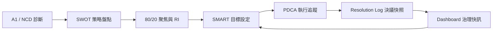

# 上雲部署說明（Church SWOT / PDCA 前端）

本專案為 **純前端（Vite + React）**，資料存於瀏覽器 `localStorage`，**不需自建後端**即可運行。下列為常見靜態託管方式。

## 建置

在專案目錄執行：

```bash
npm ci
npm run build
```

產物目錄：`dist/`。

## 給一般使用者：PDCA 不必記網址

**雙擊專案根目錄的 `pdca-planning.html`** 即可使用教會版 PDCA（純靜態頁；目前主鍵為 `chp2026-pdca-log`，會自動遷移舊鍵 `chp2026-pdca-v1`）。

## 選用：主程式深層連結（進階）

建置並以網站託管後，若要從連結直達 Hub 的 PDCA 分頁，可使用：

`https://你的網域/.../index.html?open=pdca`

## 自動測試

```bash
npm test
```

## 部署選項

### 1. Vercel

1. 將倉庫推上 GitHub／GitLab。
2. 在 [vercel.com](https://vercel.com) 匯入專案，**Framework Preset** 選 Vite。
3. **Build Command**：`npm run build`  
4. **Output Directory**：`dist`  
5. 本專案已設 `base: "./"`，可掛在子路徑；若綁定自訂網域，預設根路徑即可。

### 2. Netlify

1. Netlify 新增 site → 連接 Git 或手動拖放 `dist`。
2. Build：`npm run build`，Publish directory：`dist`。
3. 環境變數：目前無必填 API Key（AI 提示語為本機複製，未代送）。

### 3. Cloudflare Pages

1. Pages → 連接 Git，`Build command`：`npm run build`，`Build output directory`：`dist`。
2. Node 版本建議 18+（在 Pages 環境變數指定 `NODE_VERSION=20` 亦可）。

### 4. GitHub Pages

1. 若站點網址為 `https://<user>.github.io/<repo>/`，需將 `vite.config.ts` 的 `base` 設為 `"/<repo>/"` 再建置（目前為 `"./"`，適合子目錄或自訂網域根）。
2. 將 `dist` 內容推到 `gh-pages` 分支或使用 `peaceiris/actions-gh-pages` 等 Action。

### 5. Azure Static Web Apps / AWS S3 + CloudFront

- 上傳 `dist` 內容為靜態網站根目錄，**啟用 HTTPS**。
- 設定 SPA fallback：所有路徑導向 `index.html`（本應用為單頁即可）。

## 資料與隱私提醒

- **PDCA** 主鍵：`chp2026-pdca-log`（向下相容讀取 `chp2026-pdca-v1`）。
- **SWOT** 主鍵：`chp2026-swot-v1`（舊版 React Hub 曾使用 `chp2026-swot-v2`）。
- 資料僅存在**使用者瀏覽器**，清除網站資料會遺失；上雲後仍無伺服器備份，除非日後加後端同步。

## Supabase 雲端持久化（V1.0 起飛版）

- 已提供：
  - `js/persistence_provider.js`（local/hybrid/cloud 三模式）
  - `docs/specs/supabase/001_bible100_core_schema.sql`（初始化資料表）
  - `docs/specs/supabase/CLOUD_CUTOVER_GUIDE.md`（切換步驟）
- 建議首發模式：`hybrid`（本地快取 + 雲端同步）
- 入口頁 `head` 可用 meta 控制：
  - `bible100-persistence-mode`
  - `bible100-supabase-url`
  - `bible100-supabase-anon-key`

## 數據架構與治理協議（Data Schema & Governance Protocol）

本章是 `church_planning` 的資料契約（data contract）與治理約定，目標是確保跨頁面、跨版本、跨同工交接時，系統行為可預測且可維運。

### 1) 數據主權與鍵名規範（Storage Keys）

所有核心資料以 `chp2026-*` 前綴命名，表示「2026 治理閉環資料域」，預設儲存在瀏覽器 `localStorage`。

| Key | 模組 | 用途 |
| --- | --- | --- |
| `chp2026-health-profile` | NCD A2 基本資料 | 教會背景（名稱、規模、填寫角色等） |
| `chp2026-health-result` | NCD 診斷 | 八維分數、`normalizedScore`、`overallNormalized`、open answers |
| `chp2026-a1-health-results` | A1 健康量測 | 1-6 原始答案、內部標度映射、`memberSignals.serviceSatisfaction` |
| `chp2026-swot-v1` | SWOT | 八維 S/W/O/T 與 clarity、聚焦 metadata |
| `chp2026-smart-v1` | SMART | 計畫列表、S/M/A/R/T/Care、策略橋接欄位 |
| `chp2026-8020-v1` | 80/20 | 事工列、RI 相關輸入、策略顧問上下文 |
| `chp2026-8020-decision-v1` | 80/20 決策 | 最終決策與交接欄位 |
| `chp2026-pdca-log` | PDCA | 週期資料、baseline 快照、Act 決策 |
| `chp2026-pdca-v1` | PDCA 舊鍵 | legacy key，僅供遷移讀取 |
| `chp2026-resolution-log` | 治理快照 | SWOT/80-20/PDCA 的決議存檔時間序列 |
| `chp2026-governance-report-bundle` | 匯出束 | 給 AI/strategy 摘要的跨模組封裝 |

> 注意：同 repo 內尚有 `longTermPlanning_*` 舊管線，屬於平行資料域；若要互通，需明確做轉換，不建議混用鍵名。

### 2) 量尺適配協議（Scaling Protocol）

量尺統一由 `js/scaling_adapter.js` 提供，目標是把不同來源的分數對齊到 **內部標度 1.0–5.0**：

- **A1（1–6）→ 1.0–5.0**
  - 線性映射：`1 + ((x - 1) * 4 / 5)`，並截斷到 `[1, 5]`
- **NCD（0–65）→ 1.0–5.0**
  - 分段錨點映射（共識框架）：
    - `< 39`：`1.0 → 3.0`
    - `39 ~ 52`：`3.0 → 4.0`
    - `> 52`：`4.0 → 5.0`
- **站內判讀門檻（全站共用）**
  - `3.0`：邊際／黃燈起點（需關注與校準）
  - `4.0`：健康／綠燈起點（可在守住節奏前提下擴張）

這些門檻已反映於 SWOT 優先防守／突破、NCD 報告燈號、以及 PDCA 對照判讀中。

### 3) 遷移機制（Migration Logic）

為避免版本升級造成資料斷裂，PDCA 採「讀舊寫新」遷移策略：

1. 讀取 `chp2026-pdca-log`
2. 若不存在，回退讀 `chp2026-pdca-v1`
3. 舊鍵資料格式驗證通過（`version === 1`）後，立即回寫到新鍵
4. 後續操作皆以新鍵為主

此策略目前同時實作在：
- `pdca-planning.html`（靜態頁）
- `src/pdca/pdcaStorage.ts`（Vite/React 端）
- `planning/assets/pipeline.js`（戰情管線讀取）

維護原則：
- 新增遷移時，必須保持 **idempotent**（可重跑、不覆蓋有效新資料）
- 任何 schema major change 需升版欄位，禁止 silent break

### 4) 治理閉環流程（The Loop）



說明：
- A 階段產生 `normalizedScore` / `overallNormalized`
- B/C 形成優先維度與 RI 張力
- D/E 把策略轉為執行並做 baseline 對照
- F/G 把結果回流到決策層（開頁即見）

### 5) 運維建議（年度交接）

- 年度交接前先匯出（或人工備份）上述 `chp2026-*` 重要鍵
- 清理測試資料時，建議保留 `resolution-log` 歷史做治理回顧
- 若要實作「一鍵備份／清除」，請集中在設定頁，並加二次確認與可回復提示

## PDCA 相關原始碼位置

- 型別與儲存：`src/pdca/`
- 介面分頁：`src/wizard/PdcaHubTab.tsx`
- Hub 分頁入口：`src/wizard/FinalHub.tsx`（「教會版 PDCA」）
