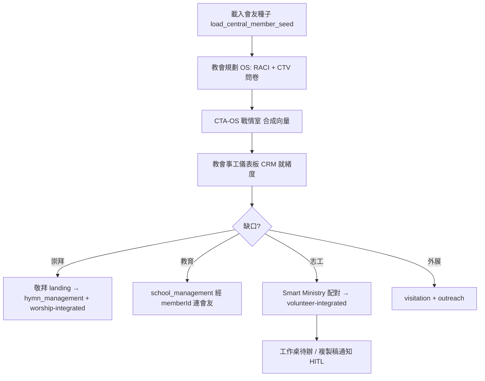

# 教會營運子系統規格（Church ERP Operation Subsystem）

**版本**：2026-06-03  
**定位**：在不改動 Bible100「教材／備課／離線」護城河的前提下，於現有 `index_v5` 殼層與 `ChurchDataBridge` 資料橋上，收斂 **雲端教會 ERP 一體機** 的落地規格。  
**主鍵**：`member_id`（等同戰略文件 PersonID，禁止另造永久 ID）  
**相關**：[`CHURCH_CRM_BLUEPRINT.md`](../church_ministry/docs/CHURCH_CRM_BLUEPRINT.md) · [`CHURCH_MINISTRY_HUB_AUDIT.md`](../church_ministry/docs/CHURCH_MINISTRY_HUB_AUDIT.md) · [`SMART_MINISTRY_DATA_RULES.md`](../smart_ministry/docs/SMART_MINISTRY_DATA_RULES.md)

---

## 0. 核心價值與雙軌敘事

| 對象 | 一句話 | 入口 |
|------|--------|------|
| 中文老師 | 任務式備課、離線可用、看得懂 | `material` / `study` / `qna` 模式（不變） |
| 教會決策者 | RACI／CTV 減少內耗，釋放 80% 行政 | `church` 模式 → 規劃 OS → 事工儀表板 |
| 同工／志工 | 填表、排班、探訪，一 ID 走全站 | `member_id` + 各工具 `form.html` |

**CTV → 智能排班 → 通知** 在本專案的正式定義：

```
CTV 問卷 / CTA-OS 評估
  → SmartMinistryCanonical.attachAssessmentToTalent
  → talent_ministry_matching（候選清單，非自動派工）
  → volunteer-integrated 排班（confirmed 後）
  → leader_outreach_snippet / 工作桌待辦（HITL 複製稿或人工發送）
  → Phase1 queue → Sync Observer（雲端雙存儲時 flush）
```

自動「推播簡訊/LINE」列為 **雲端選配**；預設 **Human-in-the-loop**，符合 PII 與牧養倫理。

---

## 1. 任務一：現有代碼盤點與功能對接

### 1.1 同步面板（⚡ 數據同步紀錄）— **可直接保留並擴展**

| 元件 | 位置 | 現況 | 對接建議 |
|------|------|------|----------|
| 頂欄按鈕 `#btnSyncObserver` | `index_v5.html` L472 | 已掛載 | 教會／AI 模式顯示；`material`/`study`/`qna` 可隱藏（L1334 已有邏輯雛形） |
| 抽屜 `#syncObserverDrawer` | `index_v5.html` L506–522 | 近期事件 + 待同步佇列 | **保留結構**；新增第三區「本機↔雲端狀態 pill」 |
| `SyncObserverDrawer` | `js/sync_observer_drawer.js` | 讀 `ChurchDataBridgePhase1.getRecentObserverEvents` / `getQueueSnapshot` | 擴充 `getSyncHealthSummary()`（待 Bridge 實作） |
| Bridge 佇列 | `js/church_data_bridge_phase1.js` | `_enqueue`、`flushQueue`、`retryQueueItem`、`markQueueItemManual` | 本機獨立部署時佇列=離線 outbox；上雲時 flush |
| 事件廣播 | `postMessage` `SYNC_OBSERVER_UPDATED` / `DATA_UPDATED` | iframe 子頁可觸發父殼刷新 | 各工具 `form.html` 提交後 `parent.postMessage` |

**建議增量（不改護城河）：**

1. 抽屜新增 **「同步健康」** 列：`localOnly` | `queued(N)` | `synced` | `conflict`。
2. `flushQueue` 按鈕（僅 `USE_API=true` 時啟用），連到 `church_ministry/modules/tech/automation-workflow.html`。
3. 雙存儲策略：`PersistenceProvider` 本機 canonical + Phase1 queue 雲端鏡像（非 24 個 SQLite）。

### 1.2 `[教會事工]` → 三級權限 Dashboard 入口

**現有基礎（可直接改裝，無需重寫殼）：**

| 層 | 現有檔案 | 能力 |
|----|----------|------|
| 模式配置 | `config/modes.json` → `id: "church"` | 第二列 A–F 場景捷徑已存在 |
| RBAC | `js/church_auth.js` | `pastor` / `admin` / `group_leader` / `volunteer` / `viewer` + `can(permission)` |
| 登入 UI | `church_ministry/admin/cloud_login.html` | demo 帳號；API 登入 hook 已有 |
| 決策儀表板 | `church_ministry/dashboard.html` | CRM 就緒度、`crm-workbench-root`、SPAC 四格 |
| 360 視圖 | `church_ministry/modules/members/member-360-timeline.html` | E1 驗收頁 |

**三級對照（產品語言 → 技術角色）：**

| 使用者 | 角色鍵 | 預設 landing | 權限重點 |
|--------|--------|--------------|----------|
| **決策者**（牧者／長執） | `pastor` | `church_planning/cta-os-war-room.html` 或 `dashboard.html` | `*`，戰情、RACI、成熟度 |
| **同工**（行政／部門） | `admin` | `church_ministry/dashboard.html` | 會友寫、財務讀、探訪、志工 |
| **志工／小組長** | `group_leader` / `volunteer` | 任務式 `form.html` + 工作桌待辦 | 限區域讀寫、`ai.draft` |

**改裝步驟（config 驅動，不動 index_v5 大結構）：**

1. `applyMode('church')` 前檢查 `ChurchAuth.isAuthRequired()`；未登入 → `contentFrame` 載入 `cloud_login.html?return=church`。
2. `Bible100Shell.loadMode('church')` 依 `ChurchAuth.getRole()` 選 `defaultEntry.path`（新增 `config/modes.json` 的 `roleEntries` 物件）。
3. 頂欄 `modes.json` 文案：`教會事工` → 副標可增 **「CRM · 三級入口」**（`topbar.en` 保留 Church Ministry）。
4. 隱藏非必要 analytics 幽靈頁入口（側欄精簡，見 CRM 藍圖 §4）。

### 1.3 `[AI 輔助 / AI Lab]` → 自動化控制台（文字／語音 CRM 接收端）

**原則**：**不取代** `ai_lab_landing.html` 的備課工作流；在 AI 模式 **新增第二入口**「營運自動化」，與 Lab 並列。

| 現有 | 升級方向 |
|------|----------|
| `config/modes.json` → `id: "ai"` | `secondaryNav` 增 `{ labelZh: "營運自動化", path: "ai_tools/pages/crm_automation_console.html" }` |
| `group-report-copilot.html` | HITL 文字→結構化→Bridge 的 **參考實作** |
| `automation-workflow.html` | 佇列執行與統計 UI |
| `ai_tools` Prompt 頁 | 保留；與 CRM intent 分流 |

新頁 `ai_tools/pages/crm_automation_console.html` 規劃見 **§4**（任務三）。

---

## 2. 決策者「一條路」（崇拜／詩歌／學校收斂）

在 **`church` 模式第二列** 之外，建議固定 **決策者動線**（可寫入 `church_ministry/docs/DECISION_MAKER_PATH.md` 連結本文件）：



| 分散模組 | 決策者單一敘事 |  canonical 入口 |
|----------|----------------|-----------------|
| 崇拜 + 詩歌 | 「主日崇拜套件」 | `church_ministry/_landing/worship.html` → `worship-integrated.html` + `hymn_management/index.html`（embed） |
| 主日學 | 「教育事工」 | `education-integrated.html` ↔ `school_management/dashboard.html`（`memberId`） |
| 規劃 + 事奉 | 「人才與策略」 | `assessment-os-hub.html` → `cta-os-war-room.html` → `talent_ministry_matching.html` |

---

## 3. 任務二：24 款工具 · 標準固定 5 頁結構

### 3.1 目錄約定

每款工具一資料夾，位於對應場景根目錄下：

```
church_ministry/tools/<tool_id>/
  index.html      # Landing · 任務說明 + 捷徑
  dashboard.html  # 圖表 · 讀 Bridge
  form.html       # 錄入 · 預留 data-crm-intent
  list.html       # 歷史 · 篩選
  setting.html    # 參數 · RBAC · 工作流開關
  tool.meta.json  # tool_id, bridgeMethods, permissions
```

模板實例：`church_ministry/_templates/tool-kit/`（可直接複製改名）。

### 3.2 UI 連貫性（現有 CSS 框架）

| 層級 | 檔案 | 用途 |
|------|------|------|
| 全站變數 | `css/unified_module_styles.css` | 色票、間距、卡片 |
| 模組殼 | `css/module_shell.css` | 嵌入 `index_v5` iframe 時 `.in-iframe` 隱藏重複頂欄 |
| 事工 UI | `church_ministry/css/church_ministry_ui.css` | `.cm-back-bar`、表單、徽章 |
| 工具列可選 | `church_ministry/assets/css/tailwind.min.css` | 新工具 tailwind 區塊（與 finance 頁一致） |

**五頁共用 markup 契約：**

1. `<head>` 必載：`unified_module_styles.css` + `church_ministry_ui.css` + `../../js/church_data_bridge.js`（深度依目錄調整）。
2. `<body class="cm-tool-page">` 頂部 **`.cm-back-bar`** 連 `{tool}/index.html` 與 `../../dashboard.html`。
3. **`.cm-tool-nav`** 五 tab：`首頁 | 儀表板 | 新增 | 清單 | 設定`（模板內建）。
4. **`form.html`**：`id="crmIntentForm"` + `data-bridge-action="saveXxx"`；隱藏欄 `member_id`。
5. **`setting.html`**：讀寫 `localStorage` 鍵 `{tool_id}_settings_v1`；雲端時改 Bridge。

### 3.3 `tool.meta.json` 最小契約

```json
{
  "tool_id": "volunteer_shift",
  "scene": "volunteer",
  "label_zh": "義工智能排班",
  "bridge": {
    "read": ["getVolunteerData", "getMembers"],
    "write": ["saveVolunteerShift"]
  },
  "permissions": {
    "form": "volunteer.write",
    "setting": "crm.admin"
  },
  "crm_intents": ["volunteer.schedule", "volunteer.leave"]
}
```

---

## 4. 任務三：AI 文字／語音 CRM 自動化接口

### 4.1 自動化控制台 UI（規劃掛點）

**檔案（待建）**：`ai_tools/pages/crm_automation_console.html`

**在 `index_v5` 的整合方式**（不改殼 HTML 結構）：

1. `config/modes.json` → `ai.secondaryNav` 增加營運自動化項。
2. 控制台頂區：
   - **文字輸入** `#crmIntentText`（多行，placeholder 小白範例）。
   - **語音** `#btnMic` → `webkitSpeechRecognition` / `SpeechRecognition`（離線不可用時降級提示）。
   - **送出** → 呼叫 `window.Bible100CrmIntent.parseAndRoute(payload)`（新 JS：`js/crm_intent_router.js`）。
3. 中區：**結構化預覽**（JSON 可編輯，比照 `group-report-copilot`）。
4. 底區：**Human-in-the-loop** 核取 + 「套用至 Bridge」+ 觸發 `postMessage({ type: 'SYNC_OBSERVER_UPDATED' })`。

**麥克風 API 注意**：僅 HTTPS 或 localhost 可用；file:// 下顯示「請改用 Serve-Bible100-local.cmd 或改文字輸入」。

### 4.2 通用 JSON 信封：`Bible100CrmIntentV1`

```json
{
  "schema_version": "bible100_crm_intent_v1",
  "request_id": "req_20260603_001",
  "source": {
    "channel": "voice|text|form_copilot",
    "raw_text": "王弟兄下週不能守門，請找同組有人代班，他最近工作壓力大要牧者關心",
    "locale": "zh-Hant",
    "operator_member_id": "42",
    "church_id": "default"
  },
  "parsed": {
    "confidence": 0.86,
    "entities": [
      { "type": "member", "member_id": "101", "name_guess": "王弟兄", "role_guess": "volunteer" }
    ],
    "intents": [
      {
        "intent": "volunteer.leave_request",
        "tool_id": "volunteer_shift",
        "priority": "normal",
        "payload": {
          "member_id": "101",
          "shift_date": "2026-06-10",
          "reason": "personal",
          "needs_replacement": true
        }
      },
      {
        "intent": "pastoral.risk_flag",
        "tool_id": "visitation_followup",
        "priority": "high",
        "payload": {
          "member_id": "101",
          "risk_tags": ["stress", "work_pressure"],
          "suggested_action": "pastor_callback_within_48h"
        }
      },
      {
        "intent": "talent.match_replacement",
        "tool_id": "volunteer_shift",
        "priority": "normal",
        "payload": {
          "ministry_id": "usher_team",
          "exclude_member_ids": ["101"],
          "ctv_weights": { "capability": 0.4, "time": 0.35, "vision": 0.25 },
          "max_candidates": 5
        }
      }
    ]
  },
  "routing": {
    "write_base": {
      "person_key": "member_id",
      "operations": [
        {
          "bridge": "ChurchDataBridge",
          "method": "appendPastoralEvent",
          "args": {
            "member_id": "101",
            "event_type": "risk_note",
            "summary": "工作壓力 · 需關懷"
          }
        }
      ]
    },
    "smart_ministry": {
      "operations": [
        {
          "api": "SmartMinistryCanonical",
          "method": "suggestMatchesForMinistry",
          "args": { "ministry_id": "usher_team", "exclude_talent_ids": ["101"] }
        }
      ]
    },
    "notifications": {
      "mode": "hitl",
      "drafts": [
        {
          "audience_role": "group_leader",
          "channel": "copy_snippet",
          "text": "【代班】下週守門需代班，系統已列出 5 位 CTV 候選，請人工邀請。"
        },
        {
          "audience_role": "pastor",
          "channel": "workbench_alert",
          "text": "王弟兄（101）壓力標記：建議 48 小時內關懷。"
        }
      ],
      "queue": {
        "enqueue_phase1": true,
        "trigger_events": ["volunteer_shift_change", "pastoral_risk_high"]
      }
    }
  },
  "human_review": {
    "required": true,
    "confirmed_by": null,
    "confirmed_at": null
  }
}
```

### 4.3 路由執行順序（`crm_intent_router.js` 規劃）

1. **Resolve `member_id`**：`CentralMemberDB` / `getMembers()` 模糊比對姓名 → 必須人工確認後才寫入。
2. **RBAC**：每個 `intent` 對照 `tool.meta.json` 的 `permissions`。
3. **Write base**：僅呼叫 `ChurchDataBridge` 公開方法（禁止直寫 localStorage）。
4. **Smart Ministry**：`suggestMatchesForMinistry` → 寫入 `ministry_assignment` 狀態 `suggested`。
5. **Risk**：`evaluateSmartAlertsAsync` + `appendPastoralEvent`；高優先級進 `dashboard` 工作桌。
6. **Notify**：僅產生 `drafts` + 可選 `_enqueue({ type: 'trigger_workflow', ... })`；**不**自動發外部訊息。

### 4.4 Gemini 解析 Prompt 要點（前端或 Cloud Function）

- 輸出 **僅 JSON**，符合 `bible100_crm_intent_v1`。
- 不得編造 `member_id`；姓名只能放 `name_guess`。
- 每個 intent 必須映射到 **§5 工具表** 的 `tool_id`。
- 含免責：AI 草稿、需同工確認。

---

## 5. 24 工具 × 現有檔案 × 接線狀態

**接線狀態圖例**

| 代碼 | 含義 |
|------|------|
| **LIVE** | 主要讀寫經 `ChurchDataBridge` / 正式 canonical |
| **PARTIAL** | 部分真數據 + 部分示意圖表 |
| **STUB** | UI 存在，資料為 demo／localStorage 孤兒鍵 |
| **MISSING** | 無對應頁或僅規劃 |

### 場景 1 · 辦公室行政

| # | 工具 | tool_id | 現有主要檔案 | 5 頁齊全? | 接線 | 下一優先 |
|---|------|---------|--------------|-----------|------|----------|
| 1 | 文檔資產管理 | `doc_assets` | `modules/library/library-management.html` | 否 | STUB | 套 tool-kit；Bridge 讀 `churchMasterDatabase` 附件切片 |
| 2 | 會議記錄自動生成 | `meeting_minutes` | `group-report-copilot.html`（類 HITL） | 否 | PARTIAL | 擴為 meeting 模板 + pastoral event |
| 3 | 智能通訊錄 | `smart_directory` | `modules/members/member-integrated.html` | 否 | LIVE | 抽出 `list.html` 視圖 + 通訊偏好欄 |
| 4 | 部門周報彙整 | `dept_weekly` | `modules/fellowship/groups-reports.html` | 否 | STUB | 接 `group-report-copilot` 匯總 |

### 場景 2 · 教會財務

| # | 工具 | tool_id | 現有主要檔案 | 5 頁齊全? | 接線 | 下一優先 |
|---|------|---------|--------------|-----------|------|----------|
| 5 | 線上奉獻與查詢 | `donation_online` | `modules/finance/finance-integrated.html` | 否 | PARTIAL | 奉獻紀錄表單 + RBAC 遮罩 |
| 6 | 日常收支記帳 | `finance_ledger` | `modules/finance/finance-management.html` | 否 | PARTIAL | 統一 `financeSystemData` 寫入 Bridge |
| 7 | 銀行流水自動對帳 | `bank_reconcile` | — | 否 | MISSING | 新建 `tools/bank_reconcile/`；匯入 CSV |
| 8 | 財報與奉獻單 | `finance_reports` | `modules/finance/finance-reports.html` | 否 | PARTIAL | 改讀 `getFinanceSummary()` |

### 場景 3 · 事工部門

| # | 工具 | tool_id | 現有主要檔案 | 5 頁齊全? | 接線 | 下一優先 |
|---|------|---------|--------------|-----------|------|----------|
| 9 | 團契小組 | `small_groups` | `modules/fellowship/small-groups-integrated.html` | 否 | LIVE | 5 頁拆分；已是 Bridge 試點 |
| 10 | 掃碼簽到 | `checkin_qr` | `modules/worship/attendance-management.html` | 否 | PARTIAL | QR + attendance → Bridge |
| 11 | 主日學學員 | `ss_students` | `school_management/*` + `education-integrated.html` | 否 | PARTIAL | `memberId` 對齊文件化 |
| 12 | 活動報名 | `event_registration` | `school_management` 課程註冊 | 否 | PARTIAL | 通用活動 `form.html` |
| 13 | 出席率統計 | `attendance_stats` | `modules/analytics/activity-statistics.html` | 否 | STUB | 改讀 Bridge attendance 切片 |

### 場景 4 · 義工管理

| # | 工具 | tool_id | 現有主要檔案 | 5 頁齊全? | 接線 | 下一優先 |
|---|------|---------|--------------|-----------|------|----------|
| 14 | 義工檔案／專長庫 | `volunteer_profile` | `modules/volunteer/volunteer-integrated.html` | 否 | LIVE | 與 Smart Ministry skills 互讀 |
| 15 | 智能自動排班 | `volunteer_shift` | `smart_ministry/talent_ministry_matching.html` + volunteer | 否 | PARTIAL | CTV 候選 → volunteer 排班表 |
| 16 | 請假調班審批 H5 | `volunteer_leave` | — | 否 | MISSING | 新建 mobile-friendly `form.html` |
| 17 | 服務工時累計 | `volunteer_hours` | volunteer 模組內片段 | 否 | STUB | `service_history` 汇总 |

### 場景 5 · 主日崇拜

| # | 工具 | tool_id | 現有主要檔案 | 5 页齊全? | 接線 | 下一優先 |
|---|------|---------|--------------|-----------|------|----------|
| 18 | 程序單生成 | `worship_order` | `modules/worship/worship-management.html` | 否 | STUB | 與 hymn 曲目連動 |
| 19 | 詩歌庫與投影 | `hymn_projection` | `hymn_management/index.html` + `song-library.html` | 否 | PARTIAL | 決策者 landing 統一入口 |
| 20 | 聚會人數統計 | `worship_attendance` | `attendance-management.html` | 否 | PARTIAL | 併入 checkin 工具 |
| 21 | 事奉崗位聯動 | `worship_team_roles` | `worship-integrated.html` + volunteer | 否 | PARTIAL | 崗位 ID 与 catalog 同步 |

### 場景 6 · 佈道外展

| # | 工具 | tool_id | 現有主要檔案 | 5 頁齊全? | 接線 | 下一優先 |
|---|------|---------|--------------|-----------|------|----------|
| 22 | 初信探訪跟進 | `visitation_followup` | `modules/support/visitation.html` + `visitationData` | 否 | LIVE | 5 頁 + newcomer SLA |
| 23 | 街頭佈道成果 | `outreach_street` | `modules/expansion/outreach-strategy.html` | 否 | STUB | 簡表 + Bridge 切片 |
| 24 | 短宣物資經費 | `mission_supply` | `modules/mission/mission-ministry.html` | 否 | STUB | 財務模組交叉引用 |
| — | 福音素材庫 | `gospel_assets` | `modules/media/digital-ministry.html` | 否 | STUB | 非 24 核心可併入 tool 23/24 |

> 註：戰略文件列 6×4=24；上表將「出席率」獨立為 #13，「活動報名」#12；福音素材併入外展場景延伸。

### 5.1 統計摘要（2026-06-03 盤點）

| 接線狀態 | 數量 |
|----------|------|
| LIVE | 4 |
| PARTIAL | 12 |
| STUB | 7 |
| MISSING | 2 |

**建議波次**

1. **波次 A**（2 週）：`volunteer_shift` 閉環 + `visitation_followup` 5 頁化 + Sync 抽屜健康列。  
2. **波次 B**（4 週）：財務 4 工具 PARTIAL→LIVE；`bank_reconcile` 新建。  
3. **波次 C**（4 週）：崇拜套件 landing + `hymn_projection`；`crm_automation_console` + intent router。  
4. **波次 D**：analytics STUB 批量改 Bridge 唯讀。

---

## 6. 與現有 CRM 工程階段對齊

| 本規格 | CRM 文件 |
|--------|----------|
| 三級 Dashboard | CRM-5 RBAC + `roleEntries` |
| 5 頁 tool-kit | Inventory I2 禁止幽靈鍵 |
| CrmIntentV1 | Automate A4 表單→CRM |
| Sync Observer | CRM-5 雲端 demo + Phase1 queue |
| CTV 排班鏈 | 藍圖 §5 互聯圖 |

---

## 7. 驗收清單（決策者可懂的一句話）

- [ ] 從 `church` 模式 3 分鐘內走到：RACI → 戰情室 → 儀表板就緒度。  
- [ ] 任一 LIVE 工具：5 頁可點通、資料刷新後儀表板數字變。  
- [ ] 控制台貼一段文字 → 產生 Intent JSON → 人工確認 → 工作桌出現待辦。  
- [ ] ⚡ 抽屜可見 queue 重試／人工介入（上雲配置下）。  
- [ ] 教材模式無 ERP 干擾（sync 鈕隱藏、預設 landing 不變）。

---

## 8. 附錄：關鍵檔案索引

| 用途 | 路徑 |
|------|------|
| 總站殼 | `index_v5.html` |
| 模式配置 | `config/modes.json` |
| 同步抽屜 | `js/sync_observer_drawer.js` |
| 資料橋 | `js/church_data_bridge.js` · `js/church_data_bridge_phase1.js` |
| 權限 | `js/church_auth.js` |
| 工具模板 | `church_ministry/_templates/tool-kit/` |
| HITL 參考 | `church_ministry/modules/fellowship/group-report-copilot.html` |

**維護**：新增工具時更新 §5 表格與 `tool.meta.json`。
