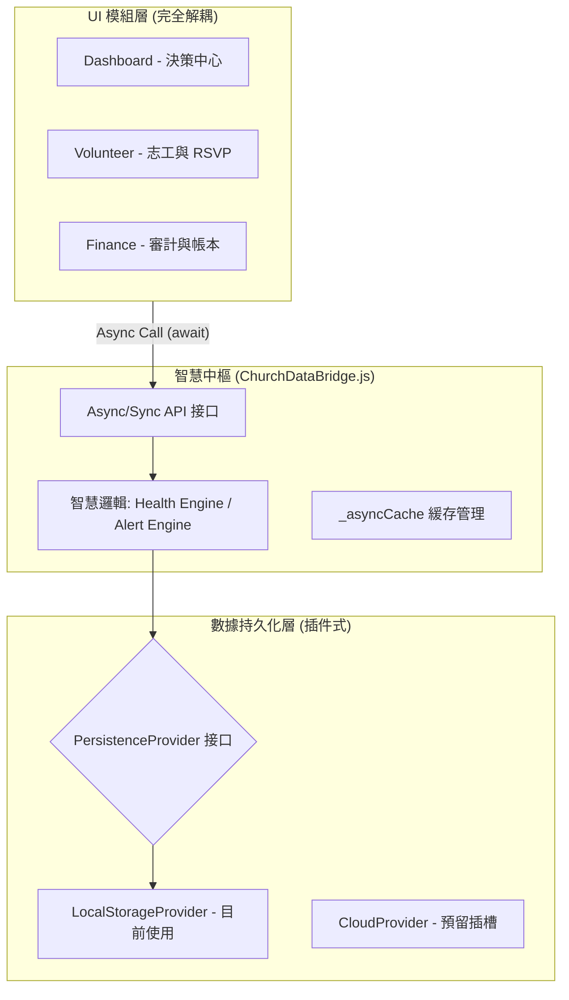

# 全模組技術與架構報告

- **版本：** 2026-04-29 (Milestone)
- **定位：** 工業級、異步驅動、具備靈命診斷能力的教會管理系統

---

## 立此存案 · 教會工具設計 Playbook（2026-05-01）

新調查表、計劃工具（SWOT／SMART／PDCA 等）、配對類頁面之**共用設計常規**（七層骨架 A～G、分析 L1～L3、Next best tool、PDF／資料注意事項）已寫入：

→ **`docs/CHURCH_TOOL_PLAYBOOK.md`**  
→ **階段 0 盤點（逐頁填空）：** `docs/PHASE0_INVENTORY_CHECKLIST.md`  
→ **若無法閱讀 .md：** 用瀏覽器開 `docs/PHASE0_INVENTORY_CHECKLIST.html`（同內容表格版）  
→ **本機頁面盤點索引（分類 + PC `file:///` 連結）：** `docs/PHASE0_PAGE_INDEX_LOCAL.html`（可執行 `python docs/_gen_phase0_index.py` 重新產生）  
→ **工程總表（全站互通 × 模組微調 × 文檔治理）：** `docs/ENGINEERING_MASTER_ROADMAP.md`（**上雲前分段與底層核對**見該檔 **§1.5**）  
→ **工具總覽內可讀索引（HTML）：** `help/project-status-hub.html`（連回本檔與工程總表；建議定期更新本檔與總表）  
→ **調查類 S1～S6 勾選表：** `docs/CHURCH_TOOL_PLAYBOOK.md` **§3.1.1**

（Cursor 無法跨時間自動提醒；請以本里程碑連結、專案 Rules 或 Issue 檢核表自行對照。模組重整**收口後**之 Shell 標準見 `.cursor/rules/bible100-shell-standard-post-refactor.mdc` 與 `docs/BACKLOG_POST_REFACTOR_SHELL.md`。）

---

## 階段 0 收口快照（2026-05-01）

- **盤點基線**：`docs/reports/site_full_audit_20260501_102749.csv`（主清單 819）  
- **品質狀態**：`missing=0`、`broken_link_files=0`、`empty_title=19`  
- **收口成果**：`docs/PHASE0_INVENTORY_CHECKLIST.md` 已填首批 20 列（調查/計劃/配對/混合）並完成兩項主線決策：
  1. `spiritual_app/index.html` 為靈命審查主入口（`index_spiritual` 導流、舊中文版退役候選）  
  2. 規劃主線鎖定 `chp2026-*`（`longTermPlanning_*` 轉為試行並待 migration）  
- **策略補充**：歷史鏡像頁之盤點排除策略已寫入 `docs/全站整全改良計劃書.md` 與 `docs/ENGINEERING_MASTER_ROADMAP.md`。
- **Phase 1-4 對齊改版**：已完成 `Next` 真實導流、Playbook 四類施工段、鍵名對齊表與治理 Gate；目前涵蓋 **P0-001~P0-080（四批）**，且 Gate 已升級為自動抓最大 P0 編號。第四批主軸為配對類（恩賜／事工／人才）主鏈與教會落地鏈。依 `docs/PLAYBOOK_ALIGNMENT_PHASE1_4.md` 之 Exit Criteria，治理對齊已收口，下一步轉入 S/P/M/H 功能工程。參考：`docs/PLAYBOOK_ALIGNMENT_PHASE1_4.md`、`docs/DATA_CONTRACT_PHASE0_ALIGNMENT.md`、`scripts/validate_phase0_playbook_gate.py`。
- **M 功能工程 · 第一批**：`smart_ministry/talent_ministry_matching.html` 已落地 **M1（可解釋因子 + 弱化總分）** 與 **M2（硬性排除／需人工確認、批量與規則建議跳過排除組合）**；資料欄位見 `smart_ministry/docs/SMART_MINISTRY_DATA_RULES.md`。
- **M 功能工程 · 延伸（M3–M5）**：配對寫入 `metadata` 含 **`trial_followup_due`（+28 天）**、**`canonical_ref`**、**`leader_outreach_snippet`**；配對頁提供複製稿；**`talent_tracking.html`** 時間軸顯示跟進日與對照鍵。
- **P 計劃鏈**：`church_planning/planning/` 已接 **L1/L2 分析**（`pipeline.js` 之 `analyzePlanningChain`）與 **`planning_chain_panel.js`** 於 `index.html`。
- **S 屬靈自評**：`church_planning/spiritual_app/index.html` 已接 **本機草稿鍵** `church_planning_spiritual_survey_v1`、**進度／稀疏預覽**、**L1/L2/Next 導覽條** 與非診斷用語提醒。
- **H 智慧整理**：`church_planning/planning/ai-summary.html` 已接 **證據強度**（`longTermPlanning_summary.evidenceLevel`）、**從屬靈自評帶入草稿**、**跟進約定**欄位與複製。
- **說明與導覽（HTML）**：`help/church-tool-four-pillars.html`（四類工具總覽）、`help/role-task-start.html`（角色×任務進站）；已掛入工具總覽側欄、`help/tools-overview.html`、`help/docs-hub.html`、`help/global-tools.htm`、`nav_hub/sitemap_navigation.html`、`nav_hub/omni_entry.html`。相對連結檢查腳本：`scripts/check_phase_tool_and_nav_links.py`（含 `nav_hub/documentation_center.html` 斷鏈修正）。

---

## 1. 核心架構圖 (System Topology)

這是系統的「三層防禦與處理」結構。

---

## 2. 模組內容與技術元素 (Module Specification)

### A. 數據中樞 (ChurchDataBridge)

- **技術核心：** 異步接口化 (Async Wrapper) 與單一事實來源 (SSOT)
- **關鍵功能：**
  - `PersistenceProvider` 契約：確保未來切換 Firebase/Supabase 時，UI 程式碼零變動
  - Audit Trail（審計軌跡）：Append-only 邏輯，所有財務與系統操作不可逆

### B. 志工與 RSVP 模組 (Stream C)

- **技術核心：** 事件驅動模型 (Event-based Store)
- **指標邏輯：**
  - 72 小時回覆窗口
  - 自動同步排班資料為 RSVP 事件，解決數據孤島問題

### C. 財務安全模組 (Finance Guard)

- **技術核心：** 軟刪除 (Soft-delete) + 數據污染防護 (PROD Guard)
- **安全機制：**
  - 禁止物理刪除，改用「沖銷審計」
  - 生產環境偵測到 Demo 數據自動觸發硬失敗

---

## 3. 智慧化引擎 (The Smart Intelligence)

### 靈命指標 (Member Health)

系統透過跨模組數據權限遮罩，計算 `Health Score (0-100)`：

- RSVP (40%)：事奉的忠心
- 出席 (40%)：聚會的穩定
- 奉獻頻率 (20%)：與教會的聯結（不看金額，只看頻率）

### 預警系統 (Smart Alerts)

- **R1 規則：** 連續 2 週（`RSVP=Declined` + `Attendance=Absent`）
- **輸出：** 直接在 Dashboard 產生「48 小時內聯繫」的行動建議

---

## 4. 上雲準備與技術債 (Cloud Readiness)

目前已完成約 **90%** 的上雲準備：

- 接口已就緒：只需實作一個 `SupabaseProvider` 對象並傳入 `configurePersistence()`
- 前端已異步化：volunteer 與 finance 頁面已優先走 `await` 流程，可處理網路延遲

待辦項目：

- Auth 模組（用戶登入權限）
- 數據遷移腳本（`bridge.migrateData()`）

---

## 5. 專案 Space 照抄清單 (複製指南)

若要在新環境部署本系統，需確保具備：

- 核心文件：`js/church_data_bridge.js`（不可缺）
- 依賴點：必須先初始化 Bridge 才能加載 UI 頁面
- 基礎數據：`memberSystemData` 為所有模組的 ID 根基

---

## 專業點評與下一步

這份報告是本階段重構工程的總結，證實系統不僅可用，且已具備：

- 可擴展（Provider 插件化、Async 化）
- 可審計（Append-only、Audit Trail）
- 可管理（Dashboard 指標 + Smart Alerts）

建議下一步優先落地：

1. 雲端 Provider（Supabase/Firebase）正式實作  
2. 權限系統（Auth + 欄位遮罩）  
3. 資料遷移與回滾機制（Migration + Backup）
