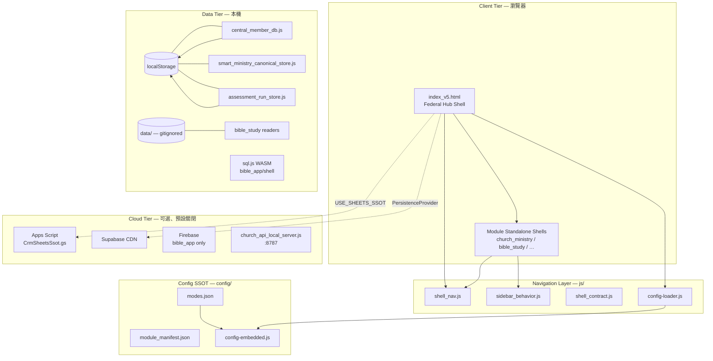

# Bible100 全站戰略架構與技術交接白皮書

**文件代號：** `FULL_STACK_ARCHITECTURE_HANDOFF_WHITEPAPER`  
**版本：** v1.0 · 2026-07-01  
**作者角色：** Chief Architect / Tech Lead  
**適用範圍：** `bible100_new/` 主站靜態平台 + `bible_app/` 獨立產品線  
**讀者：** 下一任 Tech Lead、進場智能體、人類維護者

---

## 文件摘要（Executive Summary）

Bible100 是一個**離線優先（offline-first）、靜態 HTML/JS 為主、iframe 聯邦殼架構**的多語言聖經學習與教會事工平台。其核心業務不是「堆疊更多模組」，而是讓**中文聖經老師與牧養同工**能在本機/USB/弱網環境下完成備課、查經、事工管理與教會規劃，並可選擇性接上雲端（Sheets / Supabase / Firebase）。

本白皮書基於 2026-07 工作區實際代碼逆向分析撰寫，所有路徑、契約、測試命令均可在 repo 內驗證。

---

## 1. 🌐 項目戰略意圖與核心理念（Strategic Intent & Philosophy）

### 1.1 核心業務目標與本質問題

| 維度 | 內容 |
|------|------|
| **服務對象** | 中文聖經老師、牧養同工、長執、兒少導師（次要：VI/ID/CH/AD 等小語種草稿） |
| **本質問題** | 教會與學校場景中，**聖經教材、釋經工具、事工資料、規劃決策**分散在多個系統；老師「不懂用」是最大產品風險 |
| **產品使命** | 提供**任務式入口**與**小白可懂說明**，讓使用者在本機即可備課、查經、管理會友、做教會規劃評估 |
| **成功標誌（命脈功能）** | ① 綜合解讀釋經模組可用 ② 多版本聖經閱讀穩定 ③ 教會 CRM ↔ 規劃 OS 三角互聯 ④ 六語言教材可達 |

**產品定位句（`bible_app` 延伸）：** App = 每日跑道；Bible100 網站 = 補給站。

### 1.2 核心設計哲學

#### 哲學 A：Static-First，Build-Optional

- **主站無 npm build 步驟**：`index_v5.html` + 各模組 `index.html` 可直接 `file://` 或 HTTP 開啟。
- **刻意避免**全站 React/Vite/Next 化——`church_planning/_archive/dev_vite_shell_2026-06/` 為已歸檔實驗；現行 18 個 live Planning 工具為 **Static HTML + Vanilla JS**（部分 Vue island）。
- **理由：** 目標使用者需 USB 離線攜帶、雙擊即用；構建鏈是運維負擔而非核心價值。

#### 哲學 B：Federal Hub + Module Sovereignty（聯邦殼 + 模組主權）

```
index_v5.html（L1 聯邦總殼）
├── sidebarFrame（左欄：模組側欄）
└── contentFrame（右欄：內容頁）
```

- 每模組保有 **Standalone `index.html`**（L0），可單獨上雲或離線運行。
- Hub 只負責頂層 mode 切換與**一層** iframe，**禁止殼中殼**（module `index.html` 塞入 Hub 右欄）。
- **理由：** 模組可獨立演進、獨立部署；Hub 不深入模組內部 Tab（L4/L5 由模組自理）。

#### 哲學 C：Offline-First Data, Cloud-Optional Sync

- **預設 v1：** `localStorage` 為 canonical（會友 `memberSystemData`、智慧事奉 `bible100_smart_ministry_main`、規劃評估 `bible100_assessment_*`）。
- **v2 Sheets SSOT：** 僅在使用者**明確啟用**時生效（`js/cloud_config.js` → `USE_SHEETS_SSOT: false` 為預設）。
- **v3 Cloud：** Supabase / Firebase 為規劃路徑，不自動覆蓋 v1。
- **理由：** 教會敏感資料（牧養筆記、問卷 raw）預設留本機；雲端是增強而非前提。

#### 哲學 D：Contract-Driven Navigation（契約驅動導航）

- 全站導航**禁止各師各法**：統一 `data-b100-nav`（`content` / `module`）+ `bible100ShellNav()` + 限定 `postMessage` type。
- `file://` 下 `target="contentFrame"` 不可靠 → AI Lab 等側欄強制 `data-b100-path` + `postMessage`。
- **理由：** iframe 導航是歷史性「代碼死穴」；契約 + 靜態測試是唯一可控手段。

#### 哲學 E：Teacher-First, Not Feature-First

- AI 工具做成**工作流**（Prompt 生成器 → 複製到外部 LLM → 老師審核），非 API key 綁定。
- 小語種內容為 AI 草稿，**不可視為正式神學教材**。
- **理由：** 治理規則 `bible100-current-governance.mdc` 明確優先「任務式入口」而非模組擴張。

#### 哲學 F：SSOT via Config, Not Hardcoded Nav

- 頂欄路由：`config/modes.json`（機器 SSOT）
- 模組邊界：`config/module_manifest.json`
- `file://` 鏡像：`node scripts/generate_config_embedded.js` → `js/config-embedded.js`
- **理由：** 硬編碼導覽是 v2 Sheets 規則明確禁止的反模式。

### 1.3 刻意不採用的常見架構

| 常見做法 | Bible100 選擇 | 原因 |
|----------|---------------|------|
| SPA 單頁應用 | Multi-page + iframe | 模組獨立、離線友好、漸進式維護 |
| 統一後端 API | localStorage + 可選 bridge | 無後端也能演示完整教會流程 |
| Monorepo 全量 TypeScript | 主站 Vanilla JS；`bible_app` 獨立 TS monorepo | 降低主站維護門檻 |
| Git 納入 `data/` 聖經庫 | `data/` 本機/USB only | 體積、版權、clone 後自行還原 |
| 全站暗黑模式 | 未採用；淺色教學 UI 為主 | 目標使用者場景（投影、印刷友好） |

---

## 2. 🗺️ 全站技術地圖與核心模組（System Architecture & Module Map）

### 2.1 架構拓撲總覽



### 2.2 目錄地圖與運行模式

| 目錄 | 角色 | `runtimeProfile` |
|------|------|------------------|
| `index_v5.html` | 聯邦總殼（L1） | `shell` |
| `config/` | modes、manifest、paths、languages SSOT | — |
| `js/` | 共用殼、導航、會友 DB、雲端 bridge（~40 腳本） | — |
| `languages/` | 六語言教材側欄 + landing | `shell`（mode: material） |
| `bible_study/` | 聖經研讀、對照、綜合解讀 | `shell`（mode: study） |
| `qna/` | 聖經難題 Q&A V2（全寬，隱藏外殼左欄） | `shell` |
| `church_ministry/` | 教會事工 CRM、A–E 執行層、教育整合工作桌 | `hybrid` |
| `church_planning/` | 教會規劃 OS，18 live 評估工具 | `hybrid` |
| `smart_ministry/` | 智慧事奉配對（canonical store 消費者） | standalone |
| `ai_tools/` | AI Lab + 經典工具雙入口 | `hybrid` |
| `school_management/` | 學校管理（Hub embed 全模組殼） | `shell` + embed |
| `hymn_management/` | 詩歌管理（Hub hymn-embed 模式） | standalone |
| `nav_hub/` | 目錄搜索 / 全站 meta | `standalone` |
| `help/`, `knowledge/`, `tools/` | 文檔、憲法、工具總覽 | meta |
| `bible_app/` | **獨立產品線**：Expo + core package + Firebase + shell preview | 獨立 monorepo |
| `data/` | 聖經 JSON、綜合解讀、註釋（**不在 Git**） | 本機 only |
| `archive/` | 非主線實驗（勿從主導航鏈入） | — |
| `tests/` | Python 靜態契約測試（repo 級） | — |

### 2.3 入口鏈與 Mode 路由

```
index.html → index_v5.html（預設）
  DEFAULT_SIDEBAR = languages/index_cn.html
  DEFAULT_CONTENT = languages/landing_new_cn.html
  預設 mode = material（教材與培訓）
```

**`config/modes.json` 頂欄 Mode 一覽：**

| Mode ID | 標籤 | 預設入口 |
|---------|------|----------|
| `material` | 教材與培訓 | 語言網格 → `languages/index_{code}.html` |
| `study` | 聖經研讀 | `bible_study/sidebar.html` + 版本/釋經/史地 |
| `qna` | 聖經難題 | `qna-v2` loader；`hideSecondaryBar: true` |
| `church` | 教會事工 | CRM hub + A–E + Planning + meta |
| `school` | 學校管理 | `school_management/index.html`（module-shell-embed） |
| `ai` | AI 輔助中心 | `ai_tools/sidebar_lab.html` + `ai_lab_landing.html` |

**教會模式預設（`defaultEntry`）：**
- sidebar → `church_ministry/sidebar_crm_journey.html`
- content → `church_ministry/guide_crm_journey_hub.html`

**教會規劃從 Hub 進入（鐵律）：**
- 外層 `sidebar_plan.html` + `church_planning/index_plan.html`
- **禁止**載入 `church_planning/index.html`（已改為 redirect only）

### 2.4 教會大樓三角互聯（4F / 5F）

```
5F 規劃大腦   church_planning/sidebar_plan.html + index_plan.html
              └── planning_tool_registry.js（18 live tools）
              └── assessment_run_store.js
              └── governance_crm_bridge.js → CRM UI

4F CRM 旅程   church_ministry/sidebar_crm_journey.html + guide_crm_journey_hub.html

4F 事工執行   church_ministry/sidebar_church_layout_v1.html（A–E 六類）
              └── education-integrated.html（L4 五 Tab 工作桌）
```

**Hub 進入 C 區（門訓）標準路徑：**
```
index_v5
├── sidebarFrame → church_ministry/sidebar_c_education_journey.html
└── contentFrame → church_ministry/modules/education/education-integrated.html
```

### 2.5 數據流與 Storage 契約

#### localStorage Canonical Keys

| Key / API | 檔案 | 用途 | 主鍵 |
|-----------|------|------|------|
| `memberSystemData` | `js/central_member_db.js` | 中央會友 DB | `member_id` |
| `bible100_smart_ministry_main` | `js/smart_ministry_canonical_store.js` | 智慧事奉 | `talent_id` = `member_id` |
| `bible100_assessment_runs` | `church_planning/js/assessment_run_store.js` | 規劃評估歷程 | `toolId` + run id |
| `bible100_assessment_latest_{toolId}` | 同上 | 各工具最新結果 | per tool |
| `church_data_bridge_phase1_queue` | `js/church_data_bridge_phase1.js` | 離線同步佇列 | — |

#### 聖經資料載入（多路徑，無統一 loader）

| 消費者 | 載入方式 | HTTP 需求 |
|--------|----------|-----------|
| `comprehensive_exegesis_reader.html` | `fetch()` → `data/cj/clean/Comprehensive.json` | **必須 HTTP** |
| `parallel_mode_v3.html` | 內嵌預生成 JS：`data/bibles/bible_data_*.js` | file:// 可（若 JS 存在） |
| `bible_app/shell/js/bible_reader_core.js` | sql.js WASM + `bible_reader.db` | **必須 HTTP** |
| `bible_study/js/bible-bridge.js` | 外部 CMC iframe 後備 | 需網路 |

> **注意：** `.cursorrules` 提及的 `unified-database-loader.js` **在 repo 中不存在**——各讀者各自實作載入，屬文檔滯後。

#### 雲端層（預設全關）

`js/cloud_config.js` 預設值：
- `USE_API: false`
- `USE_SHEETS_SSOT: false`
- `USE_MOCK_CLOUD: false`

啟用路徑：
- 本機 API：`node scripts/church_api_local_server.js` → `:8787`
- Sheets：`church_ministry/apps_script/CrmSheetsSsot.gs` → 部署 URL 填入 config
- Supabase：經 `PersistenceProvider` + CDN（`index_v5.html` 已掛載）

### 2.6 `bible_app/` 獨立產品線架構

```
bible_app/
├── app/                 Expo Router（React Native Web）
├── packages/core/       TrackingEngine, BibleService, catalogs, i18n
├── firebase/            Firestore rules, Cloud Functions (importFromSheets)
├── sheets/              Google Sheets 模板
├── shell/               靜態 Web 預覽（sql.js reader, tracks, landing）
└── tests/               Python + Jest (TrackingEngine)
```

- **與主站關係：** 共享品牌與內容理念；**不共享** `index_v5` 殼或 `localStorage` 鍵（除非明確 bridge 任務）。
- **雲端：** Firebase env 見 `bible_app/app/.env.example`（`EXPO_PUBLIC_FIREBASE_*`）。
- **未實作：** `READING_MOVEMENT_BACKLOG_V1.md` 記載的天路歷程、英雄榜、教會報名等。

### 2.7 核心 5 檔協同關係（Critical Path）

以下五個節點構成主站**最小關鍵路徑**；任何改動需理解其協同：

#### ① `index_v5.html` + `js/index_v5_shell.js`

- **職責：** 載入 embedded config、初始化 modes、設定 `sidebarFrame`/`contentFrame`、host Sync Observer、掛載 Supabase/PersistenceProvider。
- **協同：** 所有 `shell` mode 模組路由必經此殼。

#### ② `config/modes.json` → `js/config-embedded.js`

- **職責：** 頂欄 mode、secondaryNav、church nav groups 的機器 SSOT。
- **協同：** 改 `modes.json` 後**必須** `node scripts/generate_config_embedded.js`，否則 `file://` 與 CI 失敗。
- **測試：** `tests/test_config_embedded_sync.py`

#### ③ `js/shell_nav.js` + `js/sidebar_behavior.js`

- **職責：** 跨模組導航唯一 API；`B100SidebarNav` 處理 `data-b100-nav`；`resolveToSiteRoot()` 處理 `file://`。
- **協同：** 所有側欄、Hub 頂欄捷徑、postMessage 監聽皆依賴此對。

#### ④ `church_ministry/` + `church_planning/` 三角

- **職責：** 執行層（CRM + A–E）與決策層（18 Planning tools）互聯。
- **協同：**
  - `governance_crm_bridge.js` 將規劃旗標排入 CRM UI
  - `central_member_db.js` 提供跨模組 `member_id`
  - manifest `crossLinks` 定義三角回鏈契約
- **測試：** `tests/test_church_interconnect_smoke.py --tier all`

#### ⑤ `js/central_member_db.js` + `js/smart_ministry_canonical_store.js` + `church_planning/js/assessment_run_store.js`

- **職責：** 人員、事奉、規劃三域資料的 canonical 寫入路徑。
- **協同：** 跨模組 join 只用 `member_id` / `talent_id`，禁止自造永久人員 ID。
- **可選延伸：** `PersistenceProvider` + `church_data_bridge_phase1.js` 做雲端同步。

**端到端數據流示例（教會規劃 → CRM）：**

```
User 完成 SWOT 評估
  → assessment_run_store.js 寫入 localStorage
  → governance_crm_bridge.js 讀取 latest run
  → CRM Hub UI 顯示「待跟進」旗標
  → 點擊成員 → central_member_db.js 以 member_id 對齊
  → smart_ministry_canonical_store.js 可讀取同一 member 的事奉資料
```

### 2.8 CI / 測試金字塔

| 層級 | 命令 | 覆蓋 |
|------|------|------|
| P0 殼 | `python tests/test_index_v5_shell.py` | 總站殼結構 |
| P0 Config | `python tests/test_config_embedded_sync.py` | modes ↔ embedded 同步 |
| P0 Manifest | `python tests/test_module_manifest_p0.py` | 模組邊界 |
| 教會互聯 | `python tests/test_church_interconnect_smoke.py --tier all` | 三角導航 + 橋接 + 18 tools |
| 導航契約 | `python tests/test_church_nav_ui_contract.py` | 頂欄名詞鎖 |
| 連結 | `python scripts/check_phase_tool_and_nav_links.py` | help/nav/tools |
| 全量 | `powershell -ExecutionPolicy Bypass -File tests\run-all-tests.ps1` | 聚合 |

**環境：** CI 使用 Python 3.11 + Node 20（見 git status 中 `site-integrity.yml`；工作區可能尚未 push）。

---

## 3. ⚠️ 目前的技術困境與「代碼死穴」（Technical Debt & Hotspots）

### 3.1 架構級技術債

| ID | 問題 | 嚴重度 | 證據 | 觸發條件 |
|----|------|--------|------|----------|
| TD-01 | **iframe 導航脆弱性** | 🔴 Critical | `file://` 下 `target="contentFrame"` 會把整頁載入左欄；大量 postMessage 補丁 | 側欄未掛 `sidebar-postmsg-nav.js` 或混用 onclick |
| TD-02 | **殼中殼歷史傷痕** | 🔴 Critical | `church_planning/index.html` 已 redirect；規則仍反覆警告 | Hub 右欄誤載 module `index.html` |
| TD-03 | **Config 雙 SSOT 漂移** | 🟠 High | `config/modules.json` vs `module_manifest.json` vs `modes.json` 路徑不一致（如 languages landing、smart_ministry 僅在舊 registry） | 新智能體讀錯檔案 |
| TD-04 | **聖經資料載入碎片化** | 🟠 High | 無 `unified-database-loader.js`；各 reader 各自 fetch/embed/WASM | 新增譯本需改多處 |
| TD-05 | **`data/` 不在 Git** | 🟠 High | clone 後綜合解讀、對照模式失效 | 未執行 `run_backup_data.bat` 還原 |
| TD-06 | **文檔與代碼滯後** | 🟡 Medium | `.cursorrules` 稱 church_planning 為「Vite React 站內主用」；實際為 static tools | 誤判技術棧 |
| TD-07 | **Windows 路徑重複** | 🟡 Medium | git status 同時出現 `bible_app/shell/` 與 `bible_app\shell\` | 跨平台 clone/merge 異常 |
| TD-08 | **混合導航模式殘留** | 🟡 Medium | `index_plan.html` 等仍有 `href="#"` + `onclick="bible100ShellNav"` | 違反 UNIFIED_NAVIGATION 但未清完 |
| TD-09 | **Cleanup Wave 未完成** | 🟡 Medium | manifest wave 3 `church_ministry`、wave 5 `help/nav_hub` = `pending` | 模組根雜檔持續累積 |
| TD-10 | **外部依賴後備** | 🟡 Medium | `bible-bridge.js` → cmcbiblereading.com | 本機無 `data/cj/` 時 |

### 3.2 Fragile Code Hotspots（一改就崩）

#### Hotspot 1：`js/sidebar_behavior.js` 的 `applyTargets`

- 曾自動為連結加 `target="contentFrame"`，抵消 `data-b100-path` 修復。
- **修改風險：** AI Lab 側欄再次整頁進左欄。

#### Hotspot 2：`config/modes.json` ↔ `js/config-embedded.js` 同步

- 改 modes 忘記 regenerate → `file://` 與 HTTP 行為不一致。
- **修改風險：** 頂欄按鈕消失或指向舊路徑。

#### Hotspot 3：`church_planning/js/planning_tool_registry.js`

- 18 live tools 的唯一 SSOT；新增工具未登記 → smoke test 失敗或側欄斷鏈。
- **修改風險：** Planning 側欄與 index_plan 脫節。

#### Hotspot 4：`church_planning/js/governance_crm_bridge.js`

- CRM ↔ Planning 旗標排水；改欄位名不同步 → CRM 顯示空白或錯誤狀態。

#### Hotspot 5：`church_ministry/js/cm_shell_paths.js` + `cm_hub_detect.js`

- Standalone vs Hub 路徑前綴剝除；改錯 → 雙重 `church_ministry/` 或 404。

#### Hotspot 6：`index_v5.html` 內 `CHURCH_NAV_GROUPS` + `renderContextBar`

- 與 `bible100-ui-naming-ia-lock.mdc` 綁定；改 label 觸發 `test_church_nav_ui_contract.py` 紅燈。

#### Hotspot 7：iframe 命名衝突

- 內層 iframe 不得命名 `contentFrame`（與外殼同名）。
- **歷史案例：** 教會規劃嵌套殼導致側欄「消失」。

### 3.3 半成品功能與隱藏 Bug

| 項目 | 狀態 | 位置 | 影響 |
|------|------|------|------|
| 讀經運動（天路歷程、英雄榜） | **未實作** | `bible_app/docs/READING_MOVEMENT_BACKLOG_V1.md` | 不影響 P0 跑道 |
| `data/lexicons/`, `data/maps/` | 占位 | `data/` | 功能入口存在但無資料 |
| v2 Sheets SSOT | 程式在、預設關 | `CrmSheetsSsot.gs`, `cloud_config.js` | 誤開關無後端會報錯 |
| Supabase 雲端同步 | 可選 | `PersistenceProvider` | 未配置時應靜默降級 local |
| `church_ministry` wave 3 整理 | pending | manifest | 模組根可能有歷史雜檔 |
| 六語言小語種教材 | AI 草稿 | `languages/` | 不可作神學權威 |
| `unified-database-loader.js` | **不存在** | — | 文檔誤導維護者 |
| Apps Script v2 完整部署 | 需人工部署 | `church_ministry/apps_script/` | 非 clone 即可用 |

### 3.4 本地環境踩坑清單（Onboarding Traps）

| 陷阱 | 說明 | 解法 |
|------|------|------|
| **直接 `file://` 開綜合解讀** | `fetch(data/cj/...)` 被瀏覽器阻擋 | `.\tools\start_http_bible100.ps1` → `http://127.0.0.1:8080/index_v5.html` |
| **clone 後無 `data/`** | 釋經、對照模式空白 | 本機還原 `data/`（`run_backup_data.bat` / 手動複製） |
| **改 modes 未 embed** | file:// 頂欄舊資料 | `node scripts/generate_config_embedded.js` |
| **誤開 `USE_API: true`** | 無後端時寫入失敗 | 保持 `cloud_config.js` 預設 false |
| **在模組根建 `test/`** | 違反 P2 紀律 | 測試只放 repo `tests/` |
| **`npm run dev` 在 repo 根** | 根目錄無主站 dev script | 主站不需 npm；`bible_app/` 內 `npm install` + Expo |
| **Python 版本** | CI 用 3.11 | 建議 3.11+ 跑測試 |
| **Node 版本** | CI 用 20 | embed script、local API、bible_app 需要 |
| **Firebase 未配置** | Expo app 雲端功能不可用 | 複製 `.env.example` → `.env` 並填 key |
| **從側欄檔直接開啟驗收** | 雙欄不切換 | 必須從 `index_v5` 或模組 `index.html` 進入 |
| **快取** | `file://` 快取殼頁 | 無痕視窗 / DevTools 停用快取 / HTTP |

### 3.5 風險矩陣（修改影響面）

```
                    影響範圍
                 低 ────────── 高
            ┌─────────────────────┐
  低 脆弱度 │  help 靜態頁        │  modes.json, index_v5   │
            │  archive 內容       │  shell_nav.js          │
            ├─────────────────────┤  planning_tool_registry │
  高 脆弱度 │  單一 L5 子頁       │  sidebar_behavior.js   │
            │                     │  central_member_db.js  │
            └─────────────────────┘
```

---

## 4. 🛠️ 未來擴展指南與安全邊界（Guardrails for Next-Gen Agents）

### 4.1 必須遵守的編碼規範

#### 導航（Navigation）

1. 側欄連結**只允許四種模式**：`data-b100-nav="content"` | `"module"` | L4 Tab | `target="_blank"`。
2. `href` 用**相對路徑**（相對側欄檔）；禁止 `file:///...` 絕對路徑。
3. 禁止 `href="#"`、`javascript:void(0)` 作為主導航。
4. 禁止 inline `onclick` + `bible100ShellNav` 與 `data-b100-nav` 混用。
5. 跨模組必須 `data-b100-nav="module"` + `data-b100-sidebar` / `data-b100-content`（Hub 根相對）。
6. AI Lab 側欄：`data-b100-path` + `sidebar-postmsg-nav.js`。
7. postMessage type **不可自造**；僅限：`bible100-shell`、`navigate`、`bible100-sidebar-content-nav`。

#### 資料（Data）

1. 人員主鍵統一 `member_id`（`CentralMemberDB`）；禁止新造永久 ID。
2. 智慧事奉只經 `SmartMinistryCanonical` API 寫入 `bible100_smart_ministry_main`。
3. 規劃評估只經 `assessment_run_store.js`。
4. 敏感資料（牧養筆記、問卷 raw、Smart Ministry raw）**預設不送** Sheets / NotebookLM / 公開 API。
5. v2 Sheets SSOT **僅在任務明確要求時**啟用；不可默認覆蓋 v1 localStorage。

#### UI / IA

1. 新頁建議：`<body data-b100-module="..." data-b100-pattern="...">`。
2. 遵守 `bible100-ui-naming-ia-lock.mdc`：頂欄第二列名詞不可自改（如禁止 `5F 規劃` 作按鈕短標）。
3. 教會模式：CRM 側欄不得綁定全站公共頁（文集、憲法 → `help/sidebar_help.html`）。
4. **未要求時不引入暗黑模式**；沿用淺色教學風格（Microsoft YaHei、藍色頂欄 `#0b5fa5`）。
5. 導覽用 `<a>`，動作用 `<button>`，輸入用表單控制。

#### 模組歸屬（Module Discipline）

1. 新 HTML/JS 只進對應模組根夾；不確定 → `_archive/`。
2. 禁止在模組根新建：`node_modules/`、`test/`、`tests/`、`sub/`、`src/`、`dist/`。
3. Planning live 工具 → `church_planning/tools/` + 登記 `planning_tool_registry.js`。
4. 測試只放 repo `tests/test_*.py`，不放模組內。

#### Git / 提交

1. **禁止**未授權 `git commit` / `push`。
2. **禁止**納入 `data/`、`archive/`、`backups/`、`*.db`、`.env`、credentials。
3. 改 `modes.json` 後必 regenerate + 跑 P0 測試。

### 4.2 新功能擴展決策樹

```
新功能請求
├── 屬於現有模組？
│   ├── 是 → 進該模組子目錄（L5 頁或 L4 Tab）
│   └── 否 → 先更新 module_manifest.json 草案 + 人類確認
├── 需要新頂欄 Mode？
│   └── 是 → 改 modes.json + embed + test_index_v5_shell + test_site_modes_integrity
├── 需要持久化？
│   ├── 會友/事奉/規劃 → 用既有 canonical API
│   └── 新域 → 先寫 *_DATA_RULES.md + schema_version
├── 需要雲端？
│   └── 預設不做；任務明確才接 bridge / Sheets / Firebase
└── 需要聖經資料？
    └── 確認 data/ 本機還原 + HTTP 伺服器
```

### 4.3 改動後必跑測試（按範圍）

| 改動範圍 | 最小測試集 |
|----------|------------|
| `index_v5` / 殼 | `test_index_v5_shell.py` |
| `config/modes.json` | `generate_config_embedded.js` + `test_config_embedded_sync.py` |
| 教會側欄 / 頂欄名詞 | `test_church_nav_ui_contract.py` |
| 教會任何互聯 | `test_church_interconnect_smoke.py --tier all` |
| Planning 工具 | `test_all_live_tools_smoke.py` + registry 更新 |
| 側欄 `data-b100-nav` | `test_unified_navigation.py` |
| help/nav/tools 連結 | `check_phase_tool_and_nav_links.py` |
| 模組根結構 | `test_module_root_discipline.py` |
| bible_app core | `packages/core` Jest + `bible_app/tests/` |

### 4.4 🔒 禁止擅自重構的核心檔案（Frozen Core + Human Gate）

以下檔案在**無人類明確確認前，智能體絕對不可重寫、全量 refactor 或「順手優化」**：

#### Tier 0 — 憲法級（改一處全站導航或資料契約變更）

| 檔案 | 原因 |
|------|------|
| `index_v5.html` | 聯邦總殼；mode 初始化、iframe 佈局、Sync Observer |
| `config/modes.json` | 全站路由 SSOT |
| `js/config-embedded.js` | file:// 鏡像（應由 script 生成，手改需同步） |
| `js/shell_nav.js` | 跨模組導航唯一 API |
| `js/sidebar_behavior.js` | `data-b100-nav` 單一 handler |
| `js/shell_contract.js` | 模組殼驗證契約 |
| `js/config-loader.js` | HTTP / embedded config 分流 |

#### Tier 1 — 教會三角核心

| 檔案 | 原因 |
|------|------|
| `church_ministry/sidebar_crm_journey.html` | CRM 旅程側欄 |
| `church_ministry/sidebar_church_layout_v1.html` | A–E 執行側欄 |
| `church_planning/sidebar_plan.html` | 規劃 OS 側欄 |
| `church_planning/js/planning_tool_registry.js` | 18 live tools SSOT |
| `church_planning/js/assessment_run_store.js` | 評估資料契約 |
| `church_planning/js/governance_crm_bridge.js` | CRM ↔ Planning 排水 |

#### Tier 2 — 資料主鍵與 Canonical Store

| 檔案 | 原因 |
|------|------|
| `js/central_member_db.js` | `member_id` 全站對齊 |
| `js/smart_ministry_canonical_store.js` | 智慧事奉唯一寫入路徑 |
| `js/persistence_provider.js` | 雲端/本機雙寫抽象 |
| `js/church_data_bridge_phase1.js` | 同步佇列與觀察者 |

#### Tier 3 — 路徑解析與 Hub 嵌入檢測

| 檔案 | 原因 |
|------|------|
| `church_ministry/js/cm_shell_paths.js` | Standalone 路徑剝除 |
| `church_ministry/js/cm_hub_detect.js` | Hub 嵌入樣式切換 |
| `church_ministry/js/cm_index_shell.js` | postMessage relay |

#### Tier 4 — 配置/registry 鏡像

| 檔案 | 原因 |
|------|------|
| `config/module_manifest.json` | 模組邊界與 frozenCore 定義 |
| `config/modules.json` | 舊 registry（仍被 embed；不可未遷移就刪） |

> **允許的操作：** 在以上檔案做**最小 diff** bugfix，且必須跑對應測試並在 PR/回覆中說明。  
> **禁止的操作：** 改名函式簽名、更換 storage key、合併檔案、改 iframe 命名、刪除 postMessage type。

### 4.5 智能體行為準則（Agent Operating Protocol）

1. **先讀後改：** 大改前讀取目標檔 + 相關 `docs/governance/*.md` + 對應 `.cursor/rules/*.mdc`。
2. **一次一主題：** 不同模組大改拆批；禁止「順便整理全站」。
3. **不刪歷史：** `data/`、`archive/`、`_archive/` 內容除非人類明確要求。
4. **不新增無用頁：** 禁止重複生產頁、無入口測試頁。
5. **不擅自 npm 化主站：** 靜態模組改 React/Vite 需人類明確批准。
6. **測試失敗不提交：** 紅燈時修復或回報，不 `--no-verify`。
7. **中文響應、英文技術名詞：** 與現行治理一致。

### 4.6 推薦本地開發起手式

```powershell
# 1. 進入專案根
cd c:\Users\hlche\.cursor\bible100_new

# 2. 確認 data/ 已還原（綜合解讀必需）
# dir data\cj

# 3. 啟動 HTTP（推薦）
.\tools\start_http_bible100.ps1
# → http://127.0.0.1:8080/index_v5.html

# 4. 改 modes 後
node scripts\generate_config_embedded.js
python tests\test_config_embedded_sync.py

# 5. 教會相關改動後
python tests\test_church_interconnect_smoke.py --tier all
```

---

## 附錄 A：關鍵文件索引

| 文件 | 路徑 |
|------|------|
| 全站治理 P0 | `docs/governance/SITE_GOVERNANCE.md` |
| 統一導航法則 | `docs/governance/UNIFIED_NAVIGATION.md` |
| 模組完整性清單 | `docs/governance/MODULE_INTEGRITY_CHECKLIST.md` |
| 模組根紀律 | `docs/governance/MODULE_ROOT_DISCIPLINE.md` |
| UI 頁型目錄 | `docs/governance/UI_PATTERN_CATALOG.md` |
| 模組 manifest SSOT | `config/module_manifest.json` |
| Mode 路由 SSOT | `config/modes.json` |
| 跨模組資料規則 | `.cursor/rules/bible100-cross-module-data.mdc` |
| 現行治理總規則 | `.cursor/rules/bible100-current-governance.mdc` |
| bible_app 主計劃 | `bible_app/docs/MASTER_PLAN_V1.md` |
| 讀經運動備案 | `bible_app/docs/READING_MOVEMENT_BACKLOG_V1.md` |
| **實施補充規格 V1** | `docs/governance/IMPLEMENTATION_SUPPLEMENT_V1.md`（Onboarding、JSON Schema、AI 降級、i18n 工作流、技術決策） |

## 附錄 B：詞彙表（Glossary）

| 術語 | 定義 |
|------|------|
| **Hub** | `index_v5.html` 聯邦總殼 |
| **Standalone** | 模組自有 `index.html`，可獨立運行 |
| **L0–L5** | 導覽層級（殼 → 工作桌 Tab → 子頁） |
| **frozenCore** | P0 不可破壞檔案清單（見 manifest） |
| **SSOT** | Single Source of Truth |
| **MIC** | Module Integrity Checklist（M1–M10） |
| **4F / 5F** | 教會大樓隱喻：執行層 / 規劃決策層（**不可作 UI 按鈕主標**） |
| **Shell-in-Shell** | 殼中殼反模式 |
| **wave** | P1 分波整理計劃（manifest `cleanupWaves`） |

---

**文件結束**  
*本白皮書應隨 `module_manifest.json` version 或 frozenCore 變更而同步更新。*
