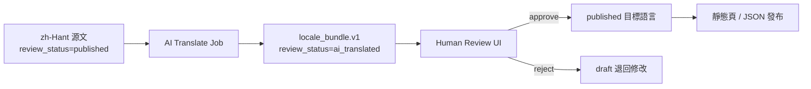

# Bible100 實施補充規格 V1

**文件代號：** `IMPLEMENTATION_SUPPLEMENT_V1`  
**版本：** v1.0 · 2026-07-01  
**附屬於：** [`FULL_STACK_ARCHITECTURE_HANDOFF_WHITEPAPER.md`](./FULL_STACK_ARCHITECTURE_HANDOFF_WHITEPAPER.md)  
**狀態：** 規格凍結草案 — 實作前須通過對應測試與人類確認

本文件回答白皮書未展開的三類問題：**具體實施細節**、**多語言工作流**、**技術決策**。所有設計對齊現行代碼（`crm_trial_welcome.js`、`church_ai_pastoral_draft.js`、`church_data_bridge_phase1.js`、`BILINGUAL_EN_BRIDGE_POLICY.md` 等），避免與 Static-First / Offline-First 哲學衝突。

---

## 第一部分：具體實施細節

### 1.1 小白引導教程 — 3 步引導流程（Onboarding v1）

#### 設計原則

- **任務導向**，非功能導覽：每步對應一個可完成動作，完成後有視覺回饋。
- **可跳過、可重播**：`localStorage` 記錄進度，不強制阻擋進階使用者。
- **從殼進入才觸發**：僅 `index_v5.html` 或帶 `?onboard=1` 時啟動（對齊 `crm_trial_welcome.js` 的 `?trial=1` 模式）。
- **不取代**既有 `building_guide_fab.js`（🏛️ 大樓三扇門）；Onboarding 是**首次**引導，FAB 是**常駐**逃生梯。

#### 目標使用者與入口

| 角色 | 預設 Onboarding 變體 | 觸發 URL |
|------|----------------------|----------|
| 聖經老師 | `teacher` | `index_v5.html?onboard=1&persona=teacher` |
| 牧養同工 | `pastor` | `index_v5.html?onboard=1&persona=pastor` |
| 教會長執 | `elder` | `index_v5.html?onboard=1&persona=elder` |
| 首次訪客（預設） | `teacher` | `index_v5.html` 首次造訪且無 `bible100_onboard_v1_done` |

#### 三步流程（固定骨架，內容依 persona 替換）

```
Step 1 · 選任務（Pick a Job）
    ↓ 使用者點選一張「我要…」任務卡
Step 2 · 走一條路（Follow One Path）
    ↓ 殼自動切 mode + sidebar + content（bible100ShellNav）
Step 3 · 完成一個動作（Do One Thing）
    ↓ 在目標頁完成勾選／複製 Prompt／標記完成 → 顯示「你已學會」
```

##### Step 1 — 選任務（UI 規格）

**元件：** 全螢幕 Modal（z-index 10050，樣式對齊 `crm_trial_welcome.js`）。

**三張任務卡（`persona=teacher` 預設文案）：**

| 卡 ID | 主標 | 副標 | 對應 Step 2 路由 |
|-------|------|------|------------------|
| `job-prep` | 我要備一節課 | 用 AI 生成可審核的備課 Prompt | mode=`ai` → `ai_tools/pages/guide_reading_hub.html` |
| `job-read` | 我要讀經查經 | 打開綜合解讀釋經 | mode=`study` → `bible_study/comprehensive_exegesis_reader.html?book=創世記&chapter=1` |
| `job-church` | 我要看教會事工 | 從 CRM 旅程地圖開始 | mode=`church` → `church_ministry/guide_crm_journey_hub.html` |

**儲存鍵：** `bible100_onboard_v1_step` = `"1"` | `"2"` | `"3"` | `"done"`  
**完成鍵：** `bible100_onboard_v1_done` = `"1"`（不再自動彈出）

##### Step 2 — 走一條路（技術契約）

```javascript
// 偽代碼 — 實作檔建議：js/onboarding_v1.js
function onboardingGoStep2(jobId) {
  const routes = {
    'job-prep':  { mode: 'ai',     sidebar: 'ai_tools/sidebar_lab.html', content: 'ai_tools/pages/guide_reading_hub.html' },
    'job-read':  { mode: 'study',  sidebar: 'bible_study/sidebar.html', content: 'bible_study/comprehensive_exegesis_reader.html?book=創世記&chapter=1' },
    'job-church':{ mode: 'church', sidebar: 'church_ministry/sidebar_crm_journey.html', content: 'church_ministry/guide_crm_journey_hub.html' }
  };
  const r = routes[jobId];
  applyMode(r.mode);  // 既有 index_v5 API
  bible100ShellNav(null, { sidebarUrl: r.sidebar, contentUrl: r.content });
  showStep2CoachMark(); // 右欄頂部浮層：「這是你要工作的區域」
  localStorage.setItem('bible100_onboard_v1_step', '2');
}
```

**Coach Mark 規則：**
- 指向 `contentFrame` 區域，不遮擋頂欄 mode 按鈕。
- 提供「下一步」與「跳過引導」。
- HTTP 環境下若綜合解讀 `fetch` 失敗，Step 2 自動降級提示：「請用本機 HTTP 開啟」（連結 `tools/start_http_bible100.ps1` 說明）。

##### Step 3 — 完成一個動作（各 job 的完成條件）

| jobId | 完成條件（可檢測） | 完成回饋 |
|-------|-------------------|----------|
| `job-prep` | 使用者點擊「複製 Prompt」或勾選「我已貼到外部 AI 並審核」 | 顯示綠色勾 + 連結 AI 倫理頁 |
| `job-read` | `contentFrame` 內釋經頁 `postMessage` `{ type:'bible100-onboard', action:'scripture_viewed' }` 或停留 ≥30s | 「你已找到釋經入口」 |
| `job-church` | 點擊 CRM 地圖上任一旅程節點 | 「你知道如何從地圖進入事工」 |

**完成後：** 寫入 `bible100_onboard_v1_done=1`，顯示摘要卡：

> 你已完成 3 步引導。之後可用右下角 🏛️ 大樓導覽隨時切換 CRM／規劃／教材。

#### 實作檔案規劃（不動 frozenCore）

| 新增檔 | 職責 |
|--------|------|
| `js/onboarding_v1.js` | 三步狀態機 + Modal + Coach Mark |
| `css/onboarding_v1.css` | 樣式（或併入 `index_v5` 內 `<style>` 區塊最小集） |
| `tests/test_onboarding_v1.py` | 靜態檢查：腳本載入、localStorage 鍵名、路由字串存在 |

`index_v5.html` 僅加一行 `<script src="js/onboarding_v1.js">` — 屬**最小侵入**，若需避免動 frozenCore 可改由 `index_v5_shell.js` 動態注入（需人類確認）。

---

### 1.2 內容結構化方案 — JSON Schema 定義

#### 分層策略

| 層級 | Schema ID | 用途 | SSOT 位置 |
|------|-----------|------|-----------|
| L0 信封 | `bible100.envelope.v1` | 所有 JSON 檔通用外層 | 本節 |
| L1 教材單元 | `bible100.lesson_unit.v1` | `languages/` 課程結構化 | `schemas/lesson_unit.v1.schema.json` |
| L2 翻譯包 | `bible100.locale_bundle.v1` | 多語言字串與內容對照 | `schemas/locale_bundle.v1.schema.json` |
| L3 AI 草稿 | `bible100.ai_draft.v1` | Prompt 產出與人工審核紀錄 | `schemas/ai_draft.v1.schema.json` |
| L4 教會資料 | `bible100.data_contract.v0.1` | 已有草案 | `docs/DATA_CONTRACT_v0.1.md` |
| L5 讀經進度 | `bible100.reading_progress.v1` | 已有草案 | `bible_app/docs/READING_STATS_SCHEMA_V1.md` |

#### L0 — 通用信封 `bible100.envelope.v1`

```json
{
  "$schema": "https://json-schema.org/draft/2020-12/schema",
  "$id": "https://bible100.local/schemas/envelope.v1.schema.json",
  "title": "Bible100EnvelopeV1",
  "type": "object",
  "required": ["schema_id", "schema_version", "module_id", "updated_at", "payload"],
  "additionalProperties": false,
  "properties": {
    "schema_id": {
      "type": "string",
      "enum": [
        "bible100.lesson_unit.v1",
        "bible100.locale_bundle.v1",
        "bible100.ai_draft.v1"
      ]
    },
    "schema_version": { "type": "integer", "minimum": 1 },
    "module_id": {
      "type": "string",
      "description": "對齊 module_manifest.json 的 id",
      "enum": ["languages", "bible_study", "ai_tools", "church_ministry", "church_planning", "bible_app"]
    },
    "content_id": {
      "type": "string",
      "pattern": "^[a-z0-9][a-z0-9._-]{2,127}$",
      "description": "模組內唯一內容 ID，如 cn.ot.genesis.ch01"
    },
    "locale_primary": {
      "type": "string",
      "enum": ["zh-Hant", "zh-Hans", "en", "vi", "id", "ch", "ad", "kh", "lo", "my"]
    },
    "review_status": {
      "type": "string",
      "enum": ["draft", "ai_translated", "human_reviewed", "published", "deprecated"]
    },
    "source_locale": {
      "type": "string",
      "description": "翻譯來源語言；原創內容可省略"
    },
    "updated_at": { "type": "string", "format": "date-time" },
    "updated_by": { "type": "string", "description": "human id 或 agent:cursor" },
    "payload": { "type": "object" }
  }
}
```

#### L1 — 教材單元 `bible100.lesson_unit.v1`

**`payload` 結構：**

```json
{
  "unit_type": "lesson",
  "track": { "code": "OT", "book": "genesis", "step": 12, "title_zh": "創世記第12步" },
  "blocks": [
    {
      "block_id": "intro",
      "block_type": "text",
      "title": { "zh-Hant": "本課重點", "en": "Key points" },
      "body": { "zh-Hant": "…", "en": "…" },
      "scripture_refs": [{ "book_id": 1, "chapter": 12, "verse_start": 1, "verse_end": 9 }]
    },
    {
      "block_id": "activity",
      "block_type": "checklist",
      "items": [{ "id": "a1", "text": { "zh-Hant": "背誦經文" } }]
    }
  ],
  "glossary_terms": [
    { "term_id": "covenant", "zh-Hant": "立約", "en": "covenant", "theology_note": "L1" }
  ],
  "ai_policy": {
    "allow_machine_translate": true,
    "require_human_review_before_publish": true
  }
}
```

**JSON Schema 片段（`schemas/lesson_unit.v1.schema.json`）：**

```json
{
  "$id": "bible100.lesson_unit.v1",
  "type": "object",
  "required": ["unit_type", "blocks"],
  "properties": {
    "unit_type": { "enum": ["lesson", "landing", "sidebar_snippet", "qna_item"] },
    "track": {
      "type": "object",
      "properties": {
        "code": { "enum": ["OT", "NT", "T4", "100steps"] },
        "book": { "type": "string" },
        "step": { "type": "integer", "minimum": 1 }
      }
    },
    "blocks": {
      "type": "array",
      "minItems": 1,
      "items": {
        "type": "object",
        "required": ["block_id", "block_type"],
        "properties": {
          "block_id": { "type": "string" },
          "block_type": { "enum": ["text", "scripture", "checklist", "media", "prompt_template"] },
          "title": { "$ref": "#/$defs/localeStringMap" },
          "body": { "$ref": "#/$defs/localeStringMap" },
          "scripture_refs": {
            "type": "array",
            "items": {
              "type": "object",
              "required": ["book_id", "chapter"],
              "properties": {
                "book_id": { "type": "integer", "minimum": 1, "maximum": 66 },
                "chapter": { "type": "integer", "minimum": 1 },
                "verse_start": { "type": "integer" },
                "verse_end": { "type": "integer" }
              }
            }
          }
        }
      }
    },
    "glossary_terms": { "type": "array" },
    "ai_policy": {
      "type": "object",
      "properties": {
        "allow_machine_translate": { "type": "boolean", "default": false },
        "require_human_review_before_publish": { "type": "boolean", "default": true }
      }
    }
  },
  "$defs": {
    "localeStringMap": {
      "type": "object",
      "minProperties": 1,
      "additionalProperties": { "type": "string" },
      "propertyNames": {
        "enum": ["zh-Hant", "zh-Hans", "en", "vi", "id", "ch", "ad", "kh", "lo", "my"]
      }
    }
  }
}
```

#### L3 — AI 草稿 `bible100.ai_draft.v1`

對齊 `church_ai_pastoral_draft.js` 與 `promptGenerator.ts`：

```json
{
  "draft_id": "uuid",
  "workflow": "pastoral_followup | lesson_prep | qna_answer",
  "prompt_text": "…",
  "model_hint": "external",
  "output_text": "…",
  "disclaimer": "此為 AI 草稿，須經牧者／同工禱告分辨後才可寫入正式紀錄",
  "citations": [{ "ref": "約3:16", "verified": false }],
  "human_review": {
    "required": true,
    "status": "pending | approved | rejected",
    "reviewer_id": null,
    "reviewed_at": null,
    "notes": ""
  },
  "downstream_write": {
    "allowed": false,
    "target": "pastoral_events | lesson_export | none",
    "written_at": null
  }
}
```

#### 驗證與落地路徑

```powershell
# 建議新增（實作後）
python scripts/validate_content_schema.py --glob "languages/content/**/*.json"
```

**遷移原則：** 現行 HTML 教材**不強制一次轉 JSON**；新內容與 AI 產出先走 Schema，舊頁以 adapter 讀取 HTML 直至 wave 整理。

---

### 1.3 AI 降級策略 — 本地規則引擎（Local Rules Engine）

#### 設計目標

當以下任一條件成立時，**不呼叫外部 LLM**，改走本地規則引擎：

- 無網路 / 使用者未配置 API
- `cloud_config.js` → `USE_API: false`（預設）
- 使用者選擇「離線模式」
- 外部 LLM 逾時或回傳空結果

#### 架構

```
User Request
    ↓
js/ai_router.js（新建，非 frozenCore）
    ├── [online + user opted in] → 外部 LLM（未來）
    └── [default] → js/ai_local_rules_engine.js
            ├── Rule Pack: lesson_prep
            ├── Rule Pack: pastoral_followup
            ├── Rule Pack: qna_triage
            └── Rule Pack: scripture_lookup（靜態經文索引）
```

#### 規則引擎 API

```javascript
// js/ai_local_rules_engine.js
AiLocalRules.run({
  pack: 'lesson_prep',       // 規則包 ID
  locale: 'zh-Hant',
  input: { bookId: 1, chapter: 12, persona: 'adult' },
  context: { memberName: null }
});
// → { ok: true, source: 'local_rules', confidence: 'low|medium', text, citations[], next_actions[] }
```

#### 規則包與具體規則

##### Pack: `lesson_prep`（對齊 promptGenerator.ts）

| Rule ID | 條件 | 輸出 |
|---------|------|------|
| `LP-01` | 永遠 | 插入硬性聲明：「AI 草稿，需牧者審核；不可編造經文」 |
| `LP-02` | `persona=child` | 追加：「用故事語氣、建議插圖、家長陪讀提示」 |
| `LP-03` | `persona=seeker` | 追加：「避免術語堆砌、強調生活應用」 |
| `LP-04` | `bookId` 已知 | 填入書卷中英文名（靜態表 `BOOK_NAMES`） |
| `LP-05` | `outputType=ppt` | 輸出 8–12 頁大綱模板（標題佔位符，非虛構內容） |
| `LP-06` | 無 `chapter` | 降級為「全書導讀框架」，confidence=`low` |

##### Pack: `pastoral_followup`（對齊 church_ai_pastoral_draft.js）

| Rule ID | 條件 | 輸出 |
|---------|------|------|
| `PF-01` | 永遠 | 輸出三行關懷摘要**模板**（需同工填入） |
| `PF-02` | `spiritualStage=new_believer` | 建議跟進：探訪 + 基要真理教材連結 |
| `PF-03` | `spiritualStage=crisis` | **不**給具體建議；輸出「請聯繫牧者／關懷同工」+ 代禱框架 |
| `PF-04` | `member_id` 存在 | 從 `CentralMemberDB` 讀取 `gifts`/`skills` 填入背景（唯讀） |
| `PF-05` | 經文建議 | 只允許輸出**預置經文方向表**（如關懷→約翰福音3章方向），禁止生成假章節 |

##### Pack: `qna_triage`

| Rule ID | 條件 | 輸出 |
|---------|------|------|
| `QT-01` | 關鍵字含「救恩|因信稱義|三位一體」 | 導向 `qna/` 對應大類 + 提醒人工查證 |
| `QT-02` | 關鍵字含「預言|日期」 | 輸出警示：「末世論爭議，需教會教導」 |
| `QT-03` | 無匹配 | 輸出結構化「提問清單」引導使用者補充經文與情境 |

##### Pack: `scripture_lookup`

| Rule ID | 條件 | 輸出 |
|---------|------|------|
| `SL-01` | `data/bibles/` 或 sql.js 可用 | 回傳實際經文節錄 |
| `SL-02` | 資料不可用 | 回傳：「請用 HTTP 開啟或還原 data/」+ 書卷目錄連結 |

#### 降級透明度（對齊 data_trust_badge.js）

每次本地規則輸出必須帶：

```json
{
  "meta": {
    "source": "local_rules",
    "pack": "lesson_prep",
    "confidence": "low",
    "trust_badge": "offline_template",
    "human_review_required": true
  }
}
```

UI 顯示：**「離線模板 · 需人工填入與審核」**（沿用 `data_trust_badge.js` 的 `STATE_LABELS` 模式）。

#### 與外部 LLM 的銜接（未來）

```
外部 LLM 回傳
    → 仍經 PF-01 / LP-01 硬性聲明後處理
    → 寫入 bible100.ai_draft.v1（human_review.status=pending）
    → 僅 human_review.status=approved 才可呼叫 ChurchAiPastoralDraft.confirmDraftToPastoralEvent()
```

---

## 第二部分：多語言工作流

### 2.1 語言分層模型

對齊 `config/languages.json` 與 `BILINGUAL_EN_BRIDGE_POLICY.md`：

| 層級 | 代碼 | 定位 | 發布門檻 |
|------|------|------|----------|
| **Canonical** | `zh-Hant` (cn) | 神學與教材源語言 | 人工定稿 |
| **Bridge** | `en` | 介面與概念橋接 | 人工或 AI+審核 |
| **Minor** | `vi`, `id`, `kh`, `lo`, `my` | AI 草稿區 | AI 翻譯 + **必須**人工審核才可 `published` |
| **Special** | `ch`（兒童）, `ad`（進階） | 改寫而非直譯 | 人工審核 |

### 2.2 翻譯流程 — AI 翻譯 → 人工審核

#### 端到端 Pipeline



#### 步驟細節

| 步驟 | 執行者 | 輸入 | 輸出 | 工具／檔案 |
|------|--------|------|------|------------|
| T1 抽取 | 工程師 / Agent | HTML 或 lesson_unit JSON | `source.json`（zh-Hant） | `scripts/i18n_extract_strings.py`（待建） |
| T2 AI 翻譯 | Cursor / 外部 LLM | `source.json` + 術語表 | `draft.{vi,id}.json` | Prompt 模板見下 |
| T3 機械檢查 | CI | draft JSON | lint 報告 | `scripts/i18n_lint.py`（待建） |
| T4 人工審核 | 母語同工 | 雙欄對照 UI | `review_status=human_reviewed` | `tools/i18n_review.html`（待建） |
| T5 發布 | 工程師 | approved bundle | 更新 HTML/JSON | Git commit（需人類授權） |

#### AI 翻譯 Prompt 模板（凍結）

```
你是聖經教材翻譯助理，不是神學權威。
任務：將以下 zh-Hant 教材譯為 {target_locale}。
硬性要求：
1. 保留所有 {glossary_term} 對照，不得自創神學術語譯法。
2. 經文引用保持原格式；不可改寫經文內容，只可翻譯周圍說明。
3. 輸出 JSON，結構與輸入完全一致，僅翻譯字串值。
4. 不確定處插入 [需人工確認] 標記。
5. 輸出頂層加 "translation_meta": { "engine": "ai", "source_locale": "zh-Hant", "target_locale": "{target_locale}" }
術語表：{glossary_json}
源文：{source_json}
```

#### 人工審核 UI 最小需求（`tools/i18n_review.html`）

- 左欄：zh-Hant 源文（唯讀）
- 右欄：目標語言可編輯
- 每段標記：`[需人工確認]` 高亮
- 按鈕：**核准** / **退回** / **匯出 JSON**
- 寫入：`reviewer_id`、`reviewed_at` 至 envelope

### 2.3 版本管理 — 追蹤各語言差異

#### 識別三元組

```
content_id + locale + schema_version
```

範例：`cn.ot.genesis.ch01` + `vi` + `1`

#### 差異追蹤檔 `locale_manifest.json`（建議路徑：`config/locale_manifest.json`）

```json
{
  "version": "1.0",
  "entries": [
    {
      "content_id": "cn.ot.genesis.ch01",
      "canonical_locale": "zh-Hant",
      "canonical_hash": "sha256:abc…",
      "canonical_updated_at": "2026-06-01T00:00:00Z",
      "locales": {
        "en": {
          "review_status": "human_reviewed",
          "content_hash": "sha256:def…",
          "updated_at": "2026-06-10T00:00:00Z",
          "behind_canonical": false
        },
        "vi": {
          "review_status": "ai_translated",
          "content_hash": "sha256:ghi…",
          "updated_at": "2026-06-05T00:00:00Z",
          "behind_canonical": true,
          "behind_reason": "canonical_hash changed 2026-06-01"
        }
      }
    }
  ]
}
```

#### 差異報告命令

```powershell
python scripts/i18n_diff_report.py --content-id cn.ot.genesis.ch01
# 輸出：哪些 locale behind_canonical、缺譯 key 列表、術語不一致
```

#### 與 Git 的關係

- **源文變更** → 自動標記所有衍生 locale 為 `behind_canonical: true`（CI 檢查）
- **不強制**所有語言同步發布；允許 vi/id 落後，但 UI 須顯示「草稿譯本」徽章

### 2.4 質量控制（QC）

#### 三層 QC 門禁

| 層級 | 檢查項 | 自動／人工 | 失敗處置 |
|------|--------|------------|----------|
| **QC-A 機械** | JSON Schema 合法、必填 locale 鍵存在、經文 ref 格式、無空字串 | 自動 CI | 阻擋 merge |
| **QC-B 術語** | glossary 一致性、禁用詞（如錯誤神學用語清單） | 自動 + 詞表 | 警告 / 阻擋 |
| **QC-C 神學** | 人工審核、牧者簽核（minor 語言） | 人工 | 維持 `ai_translated` |

#### QC-A 自動規則（`scripts/i18n_lint.py`）

1. `review_status=published` 時，禁止含 `[需人工確認]`
2. `scripture_refs` 中 `book_id` 必須 1–66
3. 目標 locale 字串長度不得 < 源文 10%（防漏譯）
4. `en` bridge 允許較長，但單個 nav label ≤ 120 字元

#### QC-B 術語表 SSOT

**路徑：** `config/theology_glossary.json`

```json
{
  "covenant": { "zh-Hant": "立約", "en": "covenant", "vi": "giao ước", "id": "perjanjian" },
  "justification": { "zh-Hant": "稱義", "en": "justification", "vi": "công chính", "id": "pembenaran" }
}
```

翻譯時 **必須**注入此表；偏離則 QC-B 失敗。

#### QC-C 人工審核清單（審核者勾選）

- [ ] 經文引用未改寫經文本身
- [ ] 無新增教義宣稱
- [ ] 文化適切（無冒犯性用語）
- [ ] 兒童內容（`ch`）語氣適齡
- [ ] 已對照 zh-Hant 源文，無漏段

#### 使用者可見的品質標籤

| 標籤 | 條件 | UI 文案 |
|------|------|---------|
| `published` | QC-A+B+C 全過 | （無徽章） |
| `ai_translated` | 僅 AI | 「AI 譯本 · 僅供參考」 |
| `draft` | 未完成 | 「草稿 · 勿用於主日學」 |

對齊 `data_trust_badge.js` 模式，在語言 landing 頂部顯示。

---

## 第三部分：技術決策

### 3.1 是否統一技術棧 — `bible_app` 與主站

#### 決策：**不統一框架；統一契約（Contract Unification）**

| 維度 | 主站 `bible100_new/` | `bible_app/` | 統一策略 |
|------|----------------------|--------------|----------|
| UI 框架 | Static HTML + Vanilla JS | Expo / React Native Web | **不統一** |
| 構建 | 無（可選 embed script） | npm workspaces | **不統一** |
| 資料契約 | localStorage v1 | AsyncStorage + Firebase | **統一 schema**（`packages/core`） |
| 業務邏輯 | 分散各模組 JS | `packages/core` TS | **抽離共用至 core** |
| 部署 | 靜態檔 + `data/` | 雲站 `bible_app/shell/` | 獨立部署單元 |

#### 理由

1. 主站使用者需要 USB 離線、雙擊即用；引入 React build 鏈違反 Static-First 哲學。
2. `bible_app` 已投入 Expo 生態（兒少 UI、推送、App Store 路徑）。
3. 強行合併會觸發全站 rewrite，風險遠大於收益。

#### 允許的「統一」邊界

```
bible_app/packages/core/
  ├── types.ts              ← 與 DATA_CONTRACT / READING_STATS 對齊
  ├── i18n/strings.ts       ← locale 鍵名 SSOT（主站可讀取編譯產物）
  ├── prompts/promptGenerator.ts
  └── tracking/TrackingEngine.ts

主站透過：
  - 複製/編譯 core 產物至 js/bible_app_core_bundle.js（未來）
  - 或 HTTP API 讀取同一份 JSON catalog
```

**禁止：** 將 `index_v5.html` 改為 React 殼；禁止主站依賴 Expo runtime。

---

### 3.2 雲端服務選擇 — Supabase vs Firebase vs 自建

#### 決策：**分域選型（Polycloud by Domain）**，預設全部關閉

| 業務域 | 推薦方案 | 備選 | 預設 | 理由 |
|--------|----------|------|------|------|
| **教會營運資料 v2**（課程、報名、導覽、KPI） | **Google Sheets + Apps Script** | 自建 API | OFF | 已有 `CrmSheetsSsot.gs`；牧者熟悉 Sheets；符合 v2 SSOT 規則 |
| **教會事工同步 v3**（會友、探訪、規劃） | **Supabase**（Postgres + Auth + RLS） | 自建 Node API | OFF | `church_data_bridge_phase1.js` 已預留 `supabaseUrl`；關聯型資料、RLS 適合多角色 |
| **bible_app 讀經雲**（進度、英雄榜、教會報名） | **Firebase**（Firestore + Functions） | — | OFF | 已有 `firebase/`、`importFromSheets`；行動端 SDK 成熟 |
| **聖經靜態內容 CDN** | 現有主機 / 自建靜態 | — | 視部署 | 無需 BaaS；`data/` 大檔走 CDN 或本機 |
| **AI 推理** | 不托管 | 使用者自備 LLM | N/A | 治理要求無 API key 綁定 |

#### 不選單一雲的原因

- 教會敏感資料（L2/L3）與讀經遊戲化進度（低敏感）需不同 RLS 策略。
- Sheets 降低非技術同工營運門檻；Firebase 適合即時 presence；Supabase 適合 SQL 報表。

#### 啟用檢查清單

| 服務 | 啟用前必須 |
|------|------------|
| Sheets SSOT | 部署 Web App URL、`USE_SHEETS_SSOT=true`、表頭契約驗證 |
| Supabase | RLS 政策審計、`PersistenceProvider` 模式設為 `hybrid` |
| Firebase | `firestore.rules` 審計、`.env` 不進 Git、英雄榜僅聚合數字 |

---

### 3.3 數據同步策略 — 實時 vs 定期

#### 決策：**Offline-First + 分域同步節奏**

| 資料類型 | 權威源（預設） | 同步模式 | 間隔／觸發 | 實作 |
|----------|----------------|----------|------------|------|
| 會友 / 事奉 / 規劃評估 | localStorage | **手動 + 佇列回放** | 使用者點「同步」或 reconnect | `church_data_bridge_phase1.js` queue |
| 營運表（Sheets v2） | Sheets（啟用時） | **定期拉取 + 寫入雙寫** | 每 5–15 分鐘或頁面 focus | `church_sheets_ssot.js` |
| 讀經進度（bible_app） | 本機 AsyncStorage | **事件驅動上傳** | 完成單元時 | `TrackingEngine` + Firestore |
| 同跑隊 presence | 雲端（未實作） | **準實時** | 30s heartbeat | Phase 2 backlog |
| 英雄榜統計 | Firestore 聚合 | **僅 Cloud Function 寫** | 進度寫入後增量 | `onProgressWrite` |
| 聖經內容 `data/` | 本機 / CDN | **靜態版本化** | 發版時 | `package_shell_deploy.ps1` |

#### 預設：**非實時（Periodic / On-Demand）**

理由：
1. 主站目標場景含 USB 離線；實時 sync 假設常駐網路。
2. 教會行政可接受「幾分鐘延遲」；換取衝突處理簡單。
3. 已有 `church_data_bridge_phase1_queue` 離線佇列模式。

#### 衝突解決（LWW + 人工）

```javascript
// 建議衝突策略（church_data_bridge_phase1 擴展）
{
  "conflict_policy": "last_write_wins",  // 同欄位以 updated_at 新者勝
  "sensitive_entities": ["pastoral_notes", "assessment_raw"],
  "sensitive_policy": "local_wins_requires_manual_merge"  // 敏感資料本機優先，雲端僅備份
}
```

#### Sync Observer（已有 UI）

`index_v5.html` 的 Sync Observer 抽屜應顯示：
- 佇列長度、`last_sync_at`、失敗原因
- 資料來源 badge（對齊 `data_trust_badge.js`）

#### 何時才用實時？

| 功能 | 建議 |
|------|------|
| 同跑隊「今日誰完成 ✓」 | 實時或 30s 輪詢（Phase 2） |
| 牧養危機通報 | **不做實時自動上傳**；人工確認後寫入 |
| 會友名冊 | 定期同步 + 手動匯出備份 |

---

## 第四部分：實施優先級與驗收

### P0（2 週內可落地，不動 frozenCore）

| 項目 | 產出 |
|------|------|
| Onboarding v1 | `js/onboarding_v1.js` + 測試 |
| AI 本地規則引擎 v0 | `js/ai_local_rules_engine.js`（lesson_prep + pastoral 兩包） |
| Schema 檔案 | `schemas/*.schema.json` + validate script |
| locale_manifest 草案 | `config/locale_manifest.json` |

### P1（1–2 月）

| 項目 | 產出 |
|------|------|
| i18n 翻譯 Pipeline | extract / lint / review UI |
| theology_glossary.json | 50+ 核心術語 |
| Supabase hybrid 路徑文件 | 更新 `CLOUD_ROADMAP.md` |

### P2（對齊 backlog）

| 項目 | 產出 |
|------|------|
| bible_app 讀經運動 | 依 `READING_MOVEMENT_BACKLOG_V1.md` |
| 實時 presence | Firebase squads |

### 驗收命令（補充）

```powershell
# Schema 驗證（實作後）
python scripts/validate_content_schema.py

# i18n 差異（實作後）
python scripts/i18n_diff_report.py --all

# 本地 AI 規則（實作後）
python tests/test_ai_local_rules_engine.py

# 回歸
python tests/test_church_interconnect_smoke.py --tier all
```

---

## 附錄：與現有檔案對照

| 本規格章節 | 現有代碼／文件 |
|------------|----------------|
| 3 步引導 | `js/crm_trial_welcome.js`、`js/building_guide_fab.js` |
| AI 工作流 | `js/church_ai_pastoral_draft.js`、`bible_app/packages/core/src/prompts/promptGenerator.ts` |
| 資料信任 UI | `js/data_trust_badge.js` |
| 同步佇列 | `js/church_data_bridge_phase1.js` |
| 雙語政策 | `docs/BILINGUAL_EN_BRIDGE_POLICY.md` |
| 語言註冊 | `config/languages.json` |
| 資料契約 | `docs/DATA_CONTRACT_v0.1.md`、`js/DATA_KEYS.md` |
| 雲端路線 | `church_ministry/docs/CLOUD_ROADMAP.md`、`docs/CLOUD_BAAS_AND_CROSS_MODULE.md` |
| bible_app 雲端 | `bible_app/docs/CLOUD_LOCAL_RUNTIME.md` |

---

**文件結束**
