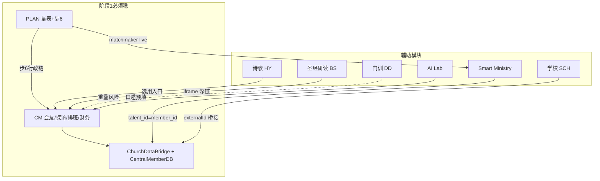

# 全站总检 Lite · 阶段 0（V0）

**生成日期：** 2026-07-29  
**目标：** 查出**未成熟页**与**危机页**，看得清；**不写**各模完整 V2 矩阵。  
**验收口径：** `file:///C:/Users/hlche/.cursor/bible100_new/index_v5.html`（Ctrl+F5）  
**下一阶段：** 依本档 §8 决策矩阵分阶段深做（阶段 1 教会脊梁）。

**相关：** [`CROSS_MODULE_DATA_CONTRACT_V1.md`](./CROSS_MODULE_DATA_CONTRACT_V1.md) · [`SITE_PAGE_REGISTRY_V1.md`](./SITE_PAGE_REGISTRY_V1.md) · [`CHURCH_MODULE_MATURITY_AUDIT_V2.md`](../../church_ministry/docs/CHURCH_MODULE_MATURITY_AUDIT_V2.md)

---

## 0. 一分钟摘要

| 级别 | 数量级 | 含义 |
|------|--------|------|
| **🔴 P0 危机** | **6 项** | 误导用户、壳中壳、误链 live 功能、双真相风险 |
| **🟠 P1 未成熟（主路径）** | **~15 项** | 基本四页、B/D 主桌、member_id 未统一 |
| **🟡 P2 未成熟（进阶/DEMO）** | **~35 项** | A 区 7 DEMO、F-4 岛、占位 2 项 |
| **⚪ P3 可忽略本轮** | 大量 | DD 章节模板、HY legacy 树、2B stub 页 |

**最强模块：** PLAN（18 live 量表）、BS 主线、HY 曲库主模块、CM-C 主日学工作桌。  
**最弱环节：** CM 数据桥未全页接入；PLAN 步 6 误链；Hub 嵌套壳（F/SMART/SCH/DD）。

---

## 1. 🔴 P0 危机登记册（必须先处理）

> **危机定义：** 用户按选单操作会进错页、丢导航、或写入第二套真相。

| ID | 危机 | 位置 | 用户看到什么 | 阶段 1 动作 |
|----|------|------|--------------|-------------|
| **C-01** | **事奉媒合误链占位** | `church_planning/sidebar_plan.html` | ~~点「事奉媒合 *」→「尚在準備」~~ | **✅ 已改 live 页** |
| **C-02** | **Hub 壳中壳 · 顶栏 F 诗歌** | `config/modes.json` F → `hymn_management/dashboard.html` | ~~总站右栏内再嵌壳~~ | **✅ 已改单内容页** |
| **C-03** | **Hub 壳中壳 · 同类** | `smart_ministry/index.html`、`school_management/index.html`、`disciple_dynamics/index.html`、`church_ministry/index.html` | embed 模式时双层 contentFrame | Hub 只载**内容页**，不载模块 L0 index（与 index-shell 规则一致） |
| **C-04** | **CRM 页仍可书签直达** | `guide_crm_journey_hub.html` 等 | ~~仍像 CRM 产品~~ | **✅ hub/trial 已 redirect** |
| **C-05** | **会友双结构 drift** | `memberSystemData` vs `churchMasterDatabase` | 不同页各写各的，统计不一致 | 阶段 1 强制经 `CentralMemberDB` + Bridge |
| **C-06** | **Smart Ministry 双 store** | `bible100_smart_ministry_main` vs legacy linking 脚本 | 配对比对结果不一致 | 新写只经 `SmartMinistryCanonical`；linking 标 legacy |

### P0 快速自测（file://）

1. 教會事工 → **G** → 步骤 6 →「事奉媒合 *」→ 若见「尚在準備」= **C-01 未修**
2. 教會事工 → **F 詩歌應用** → 右栏是否整页变成「带左栏的诗歌壳」= **C-02**
3. 直接开 `guide_crm_journey_hub.html` → 是否仍像 CRM 产品 = **C-04**

---

## 2. 🟠 P1 未成熟 · 主路径（影响日常）

### 2.1 教会基本四页（你已订 🔹 基本档 → 阶段 1 准 ✅）

| 页 | 路径 | 缺口 | 跨模 |
|----|------|------|------|
| 会友 | `church_ministry/modules/members/member-integrated.html` | 部分子 Tab 未全走 Bridge | SMART/PLAN 读 member_id |
| 探访 | `church_ministry/modules/support/visitation_index.html` | Supabase TODO 占位注释；本机 OK | B 区重复入口 |
| 排班 | `church_ministry/tools/volunteer_shift/index.html` | 无请假调班 | E 顶栏与行政共用 |
| 财务 | `church_ministry/modules/finance/finance-integrated.html` | `financialData` 别名 | 勿另开 SCH 账本 |

### 2.2 教会 A–G 主路（非 DEMO 岛）

| 区 | 主路页 | 现况 | 备注 |
|----|--------|------|------|
| A | `worship-sunday-desk.html` | 🟡→✅ 差 member 下拉 | 7 DEMO 勿并行升格 |
| B | `small-groups-integrated.html` + 探访 | 🟡 | ~10 页，名册/出席待接 member_id |
| C | `education-integrated.html` | ✅ | roster 桥接待加强 |
| D | `outreach-integrated.html` | 🟡 | strategy 单页冗余 |
| E | `volunteer_shift/index.html` | 🔹 | 同基本四页 |
| F 顶栏 | HY 模块 | ✅ 功能 / 🔴 C-02 壳 | |
| G | PLAN 全套 | ✅ / C-01 | |

### 2.3 其他模块 · 主路径未成熟

| 模块 | 危机/未成熟 | 说明 |
|------|-------------|------|
| **SMART** | demo 页 + legacy linking | 与 CM 行政出口、PLAN matchmaker 三角需契约 |
| **DD** | ~300 HTML 章节页 | 与 **CM-C 门训** 功能重叠；无统一 roster |
| **SCH** | 独立 `schoolMasterDatabase` | 与 CM 会友边界靠 `externalId`；Hub embed 同 C-03 |
| **AI** | 双入口 Lab/经典 | 尚可；`crm_automation_console` 命名易混淆 CRM 品牌 |
| **QNA** | 无双栏壳 | 设计例外；loader 族不同 |
| **NAV** | 单页 grid | Hub 用 `site_modules_sitemap` 即可 |

---

## 3. 🟡 P2 未成熟 · 进阶 / DEMO / 占位（可晚做）

### 3.1 PLAN 占位（侧栏仍可见）

| 页 | id | 侧栏位置 |
|----|-----|----------|
| `church_planning/pages/capability-placeholder.html` | `cross-risk` | 步骤 4 |
| 同上 | `leave-swap` | 步骤 6 |
| 同上 | `matchmaker` | 步骤 6 (**C-01 误链**) |

### 3.2 CM 侧栏标 `(DEMO)`（10 项）

**A 区 7：** `pulpit-ministry` · `worship-management` · `choir-team` · `instrument-team` · `worship-team-management` · `hospitality` · `sheet-music`

**F-4 岛 3：** `equipment-management` · `library-management` · `community-overview`

**建议：** 阶段 2 再议「合并进主日一桌」或永久折叠；**不要**与阶段 1 基本四页抢资源。

### 3.3 孤儿 / 退役候选（未在 A–G 选单）

| 文件 | 判定 |
|------|------|
| `guide_crm_journey_hub.html` | ❌ 退役 redirect |
| `guide_crm_for_leaders.html` | ❌ |
| `guide_crm_for_teachers.html` | ❌ |
| `guide_crm_from_learning.html` | ❌ |
| `guide_crm_trial_30min.html` | ❌ |
| `sidebar_crm_journey.html` | ❌ 仅兼容 |
| `load_crm_maturity_seed.html` | 🟡 维护者 |
| `modules/module_*/index_module_*.html` (2B) | ⚪ stub |
| `languages/lang_*/index_lang_*.html` (2B) | ⚪ stub |

---

## 4. 各模块快照（Lite · 非 V2 矩阵）

| 前缀 | 模块 | HTML≈ | 壳 W2 | 导航 W3 | 成熟度一句话 | 最大风险 |
|------|------|-------|-------|---------|--------------|----------|
| **CM** | 教会事工 | 200+ | ✅ | 🟡 | V2 已矩阵；脊梁未稳 | C-05 数据 drift、A DEMO 混淆 |
| **PLAN** | 规划 | 55+ | ✅ redirect | ✅ | 18 量表 ✅ | C-01 误链、占位 3 |
| **BS** | 圣经研读 | 80+ | ✅ | ✅ | `PAGE_MATURITY_BS.md` 较完整 | 外站 reader 🔗 |
| **HY** | 诗歌 | 15+主+legacy | ✅ | 🟡 | 曲库 ✅ | **C-02** 壳中壳 |
| **SCH** | 学校 | 25+ | ✅ | 🟡 | 独立 DB ✅ | C-03 embed、与 CM 人键桥接 |
| **AI** | AI Lab | 60+ | ✅ | ✅ | 工具集合 | CRM 命名混淆 |
| **SMART** | 智慧事奉 | 35 | ✅ | 🟡 | canonical 有 | **C-06** legacy linking |
| **DD** | 门训动力 | 300+ | ✅ | 🟡 | 章节多、工作台薄 | 与 CM-C 重复 |
| **QNA** | 难题 | 1+htm | 特殊 | 特殊 | loader 族 | 非阻塞 |
| **NAV** | 目录 | ~10 | 非标准 | 🟡 | sitemap 可用 | 非 shell |
| **MAT** | 教材 | 多语 | ✅ | ✅ | 语言入口 | 2B lang stub |

---

## 5. 跨模互动 · 效用与危机图

| 互动 | 效用 | 危机 |
|------|------|------|
| PLAN → CM 步 6 | 战略落地行政 | C-01 误链打断闭环 |
| CM 会友 → SMART | 事奉配对 | C-06 双 store |
| CM 会友 → C 主日学 roster | 名册一致 | 未全只读同步 |
| HY ↔ CM-A/F | 敬拜选诗 | C-02 重复壳 |
| AI 口述预填 → 会友 | 减录入 | 字段映射未文档化 |
| DD ↔ CM-C | 门训内容 | 双 roster 真相 |
| SCH ↔ CM | 学生与会友 | 需 externalId 契约 |

---

## 6. 壳 / 导航 Lite 检查（W2–W3）

| 检查项 | CM | PLAN | BS | HY | SCH | SMART | DD |
|--------|----|----|----|----|-----|-------|-----|
| Standalone index | ✅ | ✅ redirect | ✅ | ✅ | ✅ | ✅ | ✅ |
| Hub 应载内容非 L0 壳 | 🟡 gateway OK | ✅ index_plan | ✅ | **🔴 index** | **🔴** | **🔴** | **🔴** |
| 侧栏 content 只换右栏 | ✅ 主侧栏 | ✅ | ✅ | 🟡 | 🟡 | 🟡 | 🟡 |
| 跨模明示 module | ✅ meta 区 | ✅ 步7 | ✅ | 🟡 | 🟡 | ✅ | 🟡 |

**测试缺口：** `tests/test_unified_navigation.py` 未 watch `sidebar_church_layout_v1` / `sidebar_plan` → 阶段 1 应扩展。

---

## 7. 数据键 · 谁写谁读（危机视角）

| 键 | 写（应） | 读 | 危机 |
|----|----------|-----|------|
| `memberSystemData` | CentralMemberDB | CM/SMART/仪表 | 多页直写 |
| `churchMasterDatabase` | Bridge 同步 | CM 子模块 | 与上行双结构 |
| `visitationData` | CM 探访 | B 区、仪表 | — |
| `volunteerSystemData` | CM 排班 | E、行政 | leave-swap 占位 |
| `financeSystemData` | CM 财务 | 仪表 | `financialData` 别名 |
| `bible100_smart_ministry_main` | SmartMinistryCanonical | SMART | legacy linking |
| `schoolMasterDatabase` | SCH | SCH | member backfill |
| AssessmentRunStore | PLAN 量表 | 战情室 | — |

**契约 SSOT：** [`CROSS_MODULE_DATA_CONTRACT_V1.md`](./CROSS_MODULE_DATA_CONTRACT_V1.md)

---

## 8. 下一阶段决策矩阵（阶段 1 怎么分）

> 原则：**先修 P0 → 再稳 CM 脊梁 → DEMO 分批；不全站 V2 矩阵。**

| 顺序 | 包 | 包含 | 不做（避免浪费） |
|------|-----|------|------------------|
| **1** | **P0 清雷** | C-01～C-04 误链/壳/CRM redirect | 不动 A 区 7 DEMO 功能 |
| **2** | **CM 脊梁** | 基本四页 + Bridge + dashboard 串联 + 步 6 链 | 财务完备审批流 |
| **3** | **跨模锁契约** | C-05/C-06 SMART+member_id | DD 全站章节 |
| **4** | **主路升格** | A 主日一桌、B 小组、D 外展整合 | 设备/图书 DEMO |
| **5** | **他模 W1 Lite** | SCH/DD 边界决议写注册表 | BS/HY 已较稳处深挖 |

### DEMO → ✅ 升格门槛（阶段 2 用）

1. F 维：本页任务可独立完成  
2. D 维：经 Bridge / member_id  
3. B 维：可回到 dashboard KPI  
4. E 维：侧栏主路径或明确进阶  
5. X 维：注册表 §4 无双真相  

**A 区 7 DEMO 推荐终态：** 合并进 `worship-sunday-desk` Tab，**不是** 7 个独立 ✅。

---

## 9. 统计板（给下一阶段拍板用）

| 类别 | CM | PLAN | 他模合计 | 全站 |
|------|-----|------|----------|------|
| 🔴 P0 危机 | 2 | 1 | 3（壳/embed/store） | **6** |
| 🟠 P1 主路径未成熟 | ~12 | 0 | ~8 | **~20** |
| 🟡 P2 DEMO/占位 | ~17 | 3 | ~15 | **~35** |
| ✅ 可交付 | C/G 部分、C 区 | 18 量表+Hub | BS/HY 主模块 | — |

---

## 10. file:// 验收清单（阶段 0 交付）

- [ ] 已读 §1 P0 六项，知悉何为用户可见危机  
- [ ] 已读 §5 跨模图，知悉 DD/SMART/HY 与 CM 边界  
- [ ] 已读 [`CROSS_MODULE_DATA_CONTRACT_V1.md`](./CROSS_MODULE_DATA_CONTRACT_V1.md)  
- [ ] 阶段 1 范围拍板：建议 **包 1+2**（P0 + CM 脊梁），A 区 DEMO 不进阶段 1  

---

## 11. 维护

| 触发 | 动作 |
|------|------|
| 修 P0 项 | 更新 §1 对应行「阶段 1 动作」→ 标 ✅ |
| 新模块 W1 | 复制 §4 一行 + §11 范本，不整站重扫 |
| 侧栏/reg/config 变更 | 重跑占位/DEMO grep；更新 CM V2 |

**教會完整选单矩阵：** `church_ministry/docs/CHURCH_MODULE_MATURITY_AUDIT_V2.md`（CM 专用，非全站）

---

*阶段 0 完成。下一步：你拍板阶段 1 范围后开 Agent 执行 P0 + CM 脊梁。*
