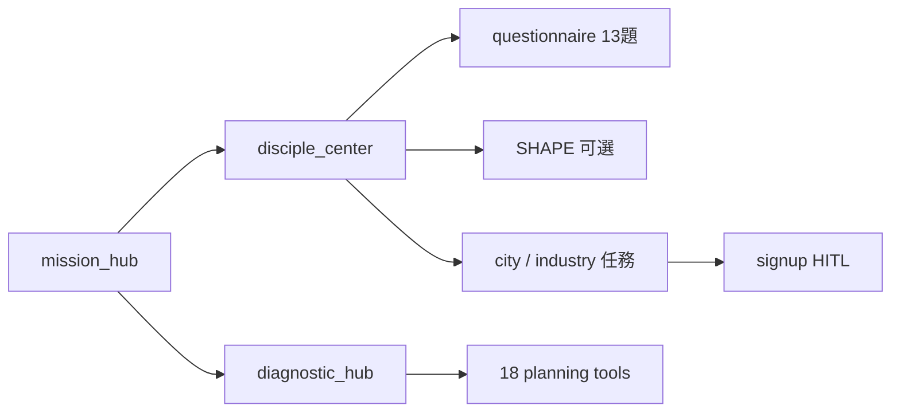

# Mission UX Wireflow V1

> Phase UX-0～3 · 教會事工第三條故事線「🎯 門徒與使命」  
> 與 `🧭 規劃`、`🟩 行政` 並列，不新增頂欄1 大模組。

## 1. 產品定位

| 維度 | 說明 |
|------|------|
| 對象 | 信徒（定位）· 牧長/長執（診斷） |
| 範圍 | Pilot 10 城市 + 10 行業任務（非 100 項） |
| 配對 | 規則分數 + **HITL**（須牧者確認，非 LLM/embedding） |
| 診斷 | 包裝既有 18 項 live 規劃工具，不重造 SWOT/PDCA |

## 2. 入口（Hub 契約）

```
index_v5 → 教會事工（頂欄1）
  └─ 頂欄2：🎯 門徒與使命
       sidebarFrame → church_ministry/mission/sidebar_mission.html
       contentFrame → church_ministry/mission/mission_hub.html
```

**禁止**：把 `church_ministry/index.html` 殼塞進 Hub 右欄（殼中殼）。

## 3. 頁面地圖（MIS/ 前綴）

| ID | 路徑 | 角色 |
|----|------|------|
| MIS-01 | `mission/mission_hub.html` | L5 Hub · 六條路線卡片 |
| MIS-02 | `mission/disciple_center.html` | 門徒定位五步 |
| MIS-03 | `mission/diagnostic_hub.html` | 三欄診斷（工具列表 + iframe + 摘要） |
| MIS-04 | `mission/city_missions.html` | 城市任務 Pilot |
| MIS-05 | `mission/industry_missions.html` | 行業使命 Pilot |
| MIS-06 | `mission/task_library.html` | 合併任務庫 |
| MIS-07 | `mission/sidebar_mission.html` | L3 使命側欄 |

## 4. 資料契約

### 4.1 任務 JSON

- `data/missions/city_tasks_v1.json`
- `data/missions/industry_tasks_v1.json`
- 欄位：`id`, `title`, `description`, `tags[]`, `difficulty`, `hours_per_month`, `category`|`industry`
- `file://` 備援：`mission/js/mission_tasks_embed.js`

### 4.2 localStorage

| Key | 用途 |
|-----|------|
| `bible100_mission_active_talent_id` | 當前定位會友 |
| `bible100_mission_signups_v1` | 任務意向登記（pending_leader） |
| `bible100_smart_ministry_questionnaire_data` | 13 題草稿（讀取配對） |

Canonical 寫入（問卷完成）：`SmartMinistryCanonical.attachAssessmentToTalent` via `talent_id`。

## 5. 使用者流程（Wireflow）



## 6. 深連結

| 從 | 到 |
|----|-----|
| disciple_center | `smart_ministry/questionnaire_system.html?talent_id=` |
| disciple_center | `church_planning/shape-gifts-assessment.html` |
| diagnostic_hub | `church_planning/assessment-os-hub.html` + registry 各工具 |
| mission_hub | `church_planning/index_plan.html`（規劃分支） |

## 7. 測試

```powershell
python tests/test_mission_ux_wireflow.py
python tests/test_config_embedded_sync.py
python tests/test_unified_navigation.py
```

## 8. 驗收（UAT）

1. HTTP 開 `index_v5.html` → 教會事工 → **🎯 門徒與使命**
2. 左欄為使命側欄，右欄為 mission_hub 六卡片
3. 門徒中心可選會友、開問卷、右欄摘要更新
4. 城市/行業頁顯示 10 項任務、配對%、加入登記
5. 診斷中心左欄列出 live 工具、中欄 iframe 可切換

---

**版本**: 1.0 · **日期**: 2026-07-27
