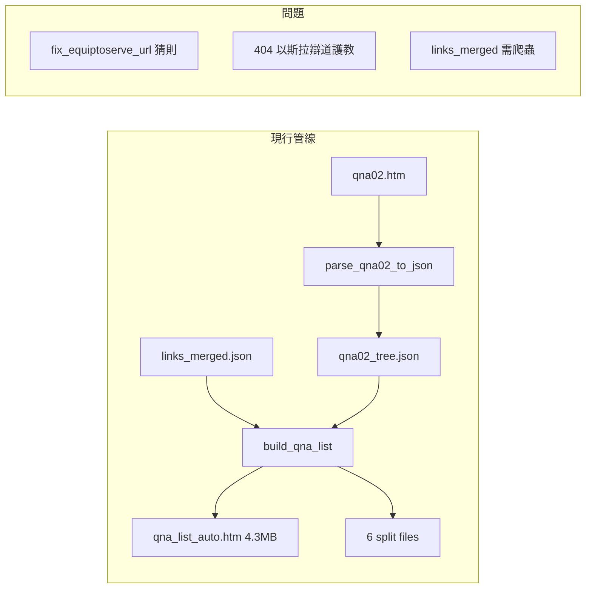
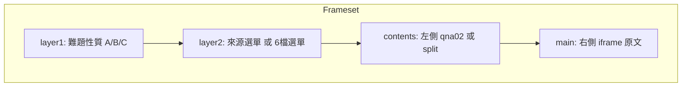

# QNA 原始方式重整計畫

## 現況與問題

- qna02.htm：約 17,065 行，連結直達原站（tochrist.org、wellsofgrace.com、equiptoserve.org 等），無需轉換
- 現行：parse → JSON → build 多層轉換，含 fix_equiptoserve_url 等推測邏輯，易造成 404
- 目標：以 qna02.htm 為唯一來源，不再依賴 JSON、links_merged、build 管線

---

## 方案：原始方式

### 第一階段：完成 qna02.htm 單檔

1. **清理 qna02.htm**
  - 移除冗長 inline style，改用簡化 CSS
  - 修正明顯錯誤連結（若有）
  - 補齊尚未完成的區塊（如 Christian Answers 中文註解區）
  - 預估：精簡後有機會控制在 1MB 內（17k 行 × 約 50 字/行 ≈ 850KB，加上精簡 CSS 可更小）
2. **加入錨點供 bookmark**
  - 在每個 h2（來源）前加 `` 等
  - 在每個 h4（書卷）前加 `` 等
  - 供 QNA.html 選單「即點即到」

### 第二階段：拆成 6 檔

1. **依 qna02 排列切分**
  - 不重組內容，只依 h2 邊界切塊
  - 切分邏輯範例（可依實際 h2 分佈調整）：
    - `qna02_1.htm`：恩泉 Archer（創～約書亞）
    - `qna02_2.htm`：恩泉 Archer（士師～瑪拉基）+ 陳終道 OT
    - `qna02_3.htm`：陳終道 NT + 其他 OT 來源
    - `qna02_4.htm`：以斯拉百科 聖經難題
    - `qna02_5.htm`：以斯拉百科 辯道護教 + 神學類
    - `qna02_6.htm`：信徒教會、葛培理等
  - 或採更單純方式：依行數/字節均分 6 段，每段約 2.8k 行
2. **產出方式**
  - 新增腳本 `scripts/split_qna02.py`：讀取 qna02.htm，依 h2 或行數切分，寫出 6 個 HTML
  - 不做 parse、JSON、URL 轉換，僅做字串切分

### 第三階段：QNA.html 與 4layer 結構

1. **QNA.html 結構（參考 [qna_index_4layer.html](qna/qna_index_4layer.html)）**

- **layer1**：聖經書卷／舊約／新約／神學／信徒教會（可簡化為 6 檔對應）
- **layer2**：6 檔選單（五經至詩歌書、先知書、福音書行傳、書信啟示錄、神學、信徒教會）
- **contents**：載入對應的 split 檔（或單檔 qna02.htm）
- **main**：點連結時 `target="main"` 直達原站

1. **Bookmark 式即點即到**
  - 選單連結：`qna02_1.htm#創世記`、`qna02.htm#src-恩泉Archer` 等
  - 點選後 contents 載入對應檔並捲至錨點

---

## 可捨棄的現有組件

| 組件                                     | 處理方式                     |
| -------------------------------------- | ------------------------ |
| qna_list_auto.htm                      | 不再產出，改由 qna02 或 split 取代 |
| parse_qna02_to_json.py                 | 停用或移除                    |
| build_qna_list.py                      | 停用或大幅精簡（僅保留 split 邏輯時使用） |
| links_merged.json                      | 不再依賴                     |
| qna02_tree.json                        | 不再依賴                     |
| qna_level1.json、qna_data_*.json        | 不再依賴                     |
| fix_equiptoserve_url、equiptoserve 相關邏輯 | 移除                       |

---

## 實作順序建議

1. 撰寫 `split_qna02.py`：純 HTML 切分，無 JSON、無 URL 轉換
2. 清理 qna02.htm：精簡 CSS、補錨點
3. 執行 split，產出 6 檔
4. 調整 QNA.html：改為 4layer 結構，layer2 指向 6 檔，contents 載入 split
5. 驗證：file:// 與 HTTP 下，點選可直達原站原文

---

## 待確認事項

1. **6 檔切分依據**：依 h2 來源邊界切，還是依行數均分？若依 h2，需先掃描 qna02 的 h2 分佈以定切點。
2. **qna02 完成度**：目前哪些區塊尚未完成？是否需手動補連結？
3. **index_file.html / index.html**：是否一併改為使用 QNA.html 或 6 檔，不再使用 qna_list_auto.htm？

